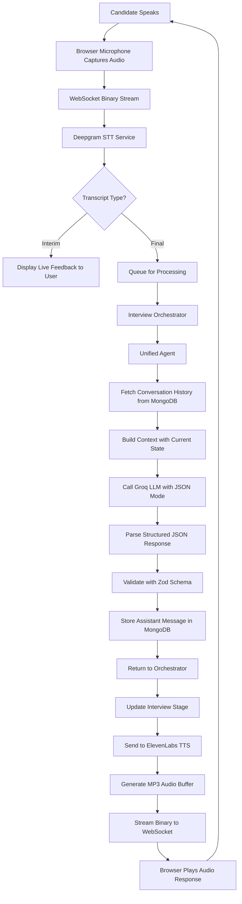
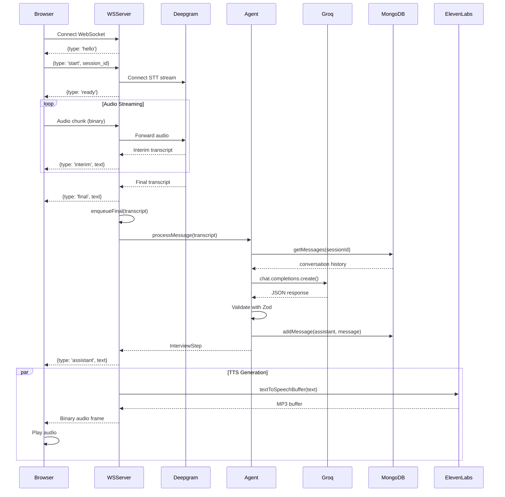

# Building a Real-Time Voice AI Agent: How I Made an LLM Behave Like a State Machine

I never thought building a voice AI agent would teach me so much about the marriage between deterministic systems and probabilistic language models. When I set out to create Julius AI, a real-time voice interview assistant powered by WebSockets and LLMs, I faced a puzzle that keeps many developers up at night: how do you make an unpredictable Large Language Model behave like a predictable state machine?

Traditional state machines are rigid and follow strict rules. You know exactly where you are and where you're going next. LLMs, on the other hand, are creative and flexible, sometimes too creative. They might decide to jump from greeting a candidate straight to asking complex algorithm questions, completely skipping the resume discussion. Not ideal for a structured interview process that needs to maintain consistency across thousands of conversations.

After months of experimentation, failed attempts, and some late-night debugging sessions involving WebSocket connections dropping at the worst possible moments, I finally cracked it. The solution involved WebSocket infrastructure for lightning-fast audio streaming, structured JSON outputs from the LLM enforced through Zod validation, and a clever orchestration layer that keeps everything in check without being rigid. Today, Julius AI conducts complete technical interviews across six stages, remembers every word of the conversation through Redis caching and MongoDB persistence, adapts to candidate responses in real-time, and never loses its place in the interview flow.

Let me take you through this journey, from the architectural decisions to the actual code that makes it all work. I'll share the mistakes I made (like trying HTTP polling for voice conversations), the breakthroughs that saved the project (structured outputs changed everything), and the patterns that emerged along the way. This isn't just a technical tutorial but a story about building something complex that actually works in production, handling real voice conversations with sub-two-second latency.

## The Technology Stack That Powers Everything

Before diving into the implementation details, let me introduce you to the technologies that power Julius AI. I didn't just pick these because they're trendy or because everyone's using them. Each choice solved a specific problem that I encountered during development.

WebSockets became my transport layer because traditional HTTP just couldn't handle the real-time demands of voice interaction. When someone speaks, you need to process that audio immediately, not wait for the next polling interval. WebSocket connections stay open, allowing bidirectional communication with minimal latency. This was crucial because voice conversations have a natural rhythm, and any delay over a second feels unnatural and frustrating.

Deepgram handles speech-to-text conversion with remarkable accuracy. What I love about Deepgram is how it provides both interim and final transcripts. The interim transcripts give users immediate feedback that the system is listening, creating that sense of engagement that makes voice interfaces feel alive. Meanwhile, the final transcripts ensure accuracy for the actual processing. This dual-stream approach creates a much better user experience than waiting for the complete transcription before showing any feedback.

ElevenLabs takes care of text-to-speech synthesis, generating natural-sounding voice responses that don't feel robotic. The audio quality matters more than you'd think. People can tell when they're talking to a poorly synthesized voice, and it affects how they perceive the entire interview experience. ElevenLabs' voices have natural prosody, appropriate pacing, and even breathing sounds that make conversations feel genuine.

Groq API serves as my LLM provider, offering incredibly fast inference times with the openai/gpt-oss-120b model. Speed matters in voice conversations more than almost any other interface. When someone finishes speaking, they expect a response within a couple of seconds, not ten or fifteen. Groq's infrastructure handles this beautifully, typically returning responses in 500 to 1000 milliseconds, which feels nearly instantaneous in conversation.

Redis acts as my high-speed cache layer for session data and conversation history during active interviews. When the agent needs to recall what was said three minutes ago to maintain context, Redis serves that data in single-digit milliseconds. MongoDB provides the permanent storage layer, keeping complete interview records for analysis and reporting after the conversation ends.

TypeScript with Node.js forms the backbone of the entire system. Type safety isn't optional when you're dealing with complex state transitions and multiple asynchronous operations happening simultaneously. TypeScript catches errors at compile time that would have been nightmares to debug in production, especially when dealing with the various data shapes flowing through WebSockets, STT services, LLMs, and TTS providers.

## Understanding the Architecture: How Everything Connects

The architecture of Julius AI follows a layered design that separates concerns beautifully. At the top sits the client browser with its WebSocket connection, microphone access, and audio playback capabilities. Below that, the WebSocket server handles the real-time audio streaming and event processing. Then comes the orchestration layer that routes conversations to the right agent based on the current interview stage. At the foundation, we have the storage layer with Redis for speed and MongoDB for persistence.

Here's how data flows through the entire system when a candidate speaks during an interview:



The beauty of this architecture lies in how each component does one thing really well. The WebSocket server doesn't try to understand interview stages or conversation context. The orchestrator doesn't worry about audio formats or network protocols. The agent focuses purely on generating contextual responses based on conversation history and current state. This separation makes the system both maintainable and scalable, allowing me to optimize each layer independently.

Let me show you how the WebSocket server manages client connections. This is where everything starts:

```typescript
import { WebSocketServer, type WebSocket } from 'ws';
import { DeepgramSTTService } from '../lib/utils/deepgramSTT';
import { InterviewOrchestrator } from '../lib/services/orchestrator';
import { textToSpeechBuffer } from '../lib/utils/elevenlabsTTS';

type ClientState = {
  ws: WebSocket;
  sessionId: string;
  userId?: string;
  stt: DeepgramSTTService;
  orchestrator: InterviewOrchestrator;
  lastInterim: string;
  lastFinal: string;
  processing: boolean;
  finalQueue: string[];
  lastFinalAt: number | null;
};

const PORT = Number(process.env.REALTIME_PORT || 3001);
const wss = new WebSocketServer({ port: PORT });

console.log(`WebSocket server listening on ws://localhost:${PORT}`);

wss.on('connection', (ws) => {
  const state: ClientState = {
    ws,
    sessionId: 'default',
    stt: new DeepgramSTTService(),
    orchestrator: new InterviewOrchestrator('default'),
    lastInterim: '',
    lastFinal: '',
    processing: false,
    finalQueue: [],
    lastFinalAt: null,
  };

  ws.send(JSON.stringify({ type: 'hello', message: 'ws_connected' }));
});
```

Every WebSocket connection gets its own state object. This state includes the Deepgram STT service instance, an orchestrator for managing interview flow, and a queue for processing final transcripts. The queue is crucial because transcripts can arrive faster than we can process them, especially if the candidate speaks quickly or in short bursts. Without the queue, we'd either drop transcripts or end up with race conditions where responses arrive out of order.

## The Biggest Challenge: Making LLMs Behave Like State Machines

Here's where things got really interesting. Traditional state machines are straightforward. You have a current state, you receive an input, you transition to a new state. Simple, predictable, deterministic. If you're in the GREET state and you've asked four questions, you move to the RESUME state. No surprises, no creativity, just cold hard logic:

```typescript
// Traditional state machine logic - simple and predictable
if (currentState === 'GREET' && questionCount >= 4) {
  currentState = 'RESUME';
  triggerResumeIntro();
}
```

But LLMs don't work like this at all. They're probabilistic by nature, generating text based on statistical patterns learned from massive amounts of training data. Ask an LLM the same question twice, and you might get two completely different answers. This flexibility makes them amazing for conversations but terrible for maintaining structured flows. An LLM might decide to jump from introducing itself straight to asking about distributed systems architecture, completely bypassing the resume discussion and getting-to-know-you questions.

I spent weeks wrestling with this problem. My early prototypes would go off the rails constantly. The agent would ask three great questions, then suddenly decide the interview was over. Or it would get stuck in a loop, asking variations of the same question five times. Or it would transition to a random stage for no apparent reason. The logs were full of state transitions that made absolutely no sense from a structured interview perspective.

The breakthrough came when I stopped trying to fight the LLM's nature and instead constrained it cleverly. Instead of asking the LLM to generate free-form text and then hoping it would follow instructions, I forced it to return structured data that I could validate and control. This approach combined three key techniques that transformed everything.

## Forcing Structure Through JSON Mode and Schema Validation

The first technique was making the LLM return JSON instead of plain text. Most modern LLM APIs support a JSON mode where the model is constrained to output valid JSON. This was game-changing because now I could define exactly what shape the response should take.

I created a strict schema using Zod, a TypeScript validation library that's become my go-to tool for runtime type checking:

```typescript
// lib/models/models.ts
import { z } from "zod";

export const InterviewStepSchema = z.object({
  assistant_message: z.string(),
  state: z.string(),
  substate: z.string()
});

export type InterviewStep = z.infer<typeof InterviewStepSchema>;
```

This schema defines exactly what every agent response must contain: an assistant message with the actual conversational text, a state indicating which stage of the interview we're in, and a substate for finer-grained control within that stage. The Zod library validates responses at runtime, catching any deviations from this structure immediately.

But having a schema isn't enough. You also need to make the LLM actually use it. This brings us to the second technique: treating prompts as programming interfaces.

## Programming the LLM Through Detailed Prompts

I stopped thinking of prompts as instructions and started treating them like function specifications. My prompt file became a detailed state machine definition that the LLM had to follow. Here's an excerpt from the actual prompt that drives Julius AI:

```text
**STATE: greet**
Substates: greet_intro, greet_background, greet_expectations, greet_tech_stack

greet_intro: Welcome warmly, introduce yourself as Julius the AI interviewer, 
  ask about their current role (Question 1)
  
greet_background: Ask about their experience level and career goals (Question 2)

greet_expectations: Ask what they hope to achieve from this interview (Question 3)

greet_tech_stack: Ask about preferred programming languages and technology stack (Question 4)

After completing all substates, set state to "resume", substate to "resume_overview"

**Always use JSON Mode and return the output in EXACTLY THIS FORMAT:**
{
  "assistant_message": "<Your response here - NO EMOJIS>",
  "state": "<greet | resume | cs | behave | wrap_up | end>",
  "substate": "<specific substate from above>"
}
```

Notice how explicit this is. I'm not suggesting or hinting at what the LLM should do. I'm specifying exactly what each substate means, what question to ask, and what the valid state transitions are. The prompt even includes a JSON example showing the exact format required. This level of detail transformed the LLM from an unpredictable conversation generator into a reliable state machine simulator.

The prompt defines all six stages of the interview flow, from greeting through resume discussion, computer science questions, behavioral assessment, and finally wrap-up. Each stage has its own substates, and each substate has clear instructions about what to do and when to move forward.

Here's how the interview stages flow through the system:

```mermaid
stateDiagram-v2
    [*] --> GREET
    GREET --> greet_intro
    greet_intro --> greet_background
    greet_background --> greet_expectations
    greet_expectations --> greet_tech_stack
    greet_tech_stack --> RESUME
    
    RESUME --> resume_overview
    resume_overview --> resume_projects
    resume_projects --> resume_challenges
    resume_challenges --> resume_lessons
    resume_lessons --> CS
    
    CS --> cs_intro
    cs_intro --> cs_databases
    cs_databases --> cs_systems
    cs_systems --> cs_algorithms
    cs_algorithms --> BEHAVIORAL
    
    BEHAVIORAL --> behave_intro
    behave_intro --> behave_teamwork
    behave_teamwork --> behave_conflict
    behave_conflict --> behave_leadership
    behave_leadership --> WRAPUP
    
    WRAPUP --> wrap_feedback
    wrap_feedback --> wrap_strengths
    wrap_strengths --> wrap_improvements
    wrap_improvements --> wrap_final
    wrap_final --> END
    
    END --> [*]
```



This visualization shows the complete interview flow. Each box represents a state or substate, and the arrows show valid transitions. The LLM can only move along these defined paths, creating predictable progression while maintaining conversational flexibility within each stage.

## Runtime Validation: The Safety Net

The third technique is runtime validation. Even with JSON mode and detailed prompts, LLMs can still surprise you. Sometimes the model returns a state that doesn't exist. Sometimes it tries to jump from greet to end, skipping everything in between. That's where validation comes in.

Here's the actual code from the unified agent that makes LLM calls and validates the responses:

```typescript
// lib/services/unified_agent.ts
const completion = await groqClient.chat.completions.create({
  model: "openai/gpt-oss-120b",
  messages,
  temperature: 0.8,
  top_p: 0.95,
  response_format: { type: "json_object" }
});

const raw = completion.choices[0].message.content;
if (!raw) throw new Error("Failed to get AI response content");

let parsed: unknown;
try {
  parsed = JSON.parse(raw);
} catch (err) {
  throw new Error(`Failed to JSON.parse AI response: ${(err as Error).message}`);
}

const validation = InterviewStepSchema.safeParse(parsed);
if (!validation.success) {
  const issues = validation.error.format();
  throw new Error(`AI response did not match InterviewStep schema: ${JSON.stringify(issues)}`);
}

const aiMessage = validation.data;
```

This code makes the LLM call with explicit JSON mode, parses the response, and validates it against our schema using Zod's safeParse method. If validation fails, we get detailed error information about what went wrong. This catches malformed responses before they can cause problems downstream.

The orchestrator adds another layer of validation, checking that state transitions make sense:

```typescript
// lib/services/orchestrator.ts
const allowedStates = ['greet','resume','cs','behave','wrap_up','end'];
if (!allowedStates.includes(response.state)) {
  console.warn(`Agent returned invalid state '${response.state}', coercing to current state`);
  response.state = this.getStateForStage(this.currentStage);
}
```

If the LLM returns an invalid state, we don't crash. We log a warning and coerce it back to the current state. This creates a system that's both flexible and safe. The LLM provides conversational intelligence, but the validation layer ensures structural integrity.

This hybrid approach taught me something important: you don't need to choose between flexibility and predictability. You can have both by treating the LLM as a constrained function. Input is conversation context plus current state. Output is next state plus message. The LLM fills in the conversational details while the validation enforces the rules.

## Why WebSockets Changed Everything for Voice Interfaces

When I first started building Julius AI, I tried using HTTP polling. The client would send a request every 200 milliseconds asking if there were any new transcripts or responses. This seemed reasonable at first, but voice conversations exposed the problems immediately.

HTTP polling introduces latency at multiple points. There's the polling interval itself, typically between 100 and 500 milliseconds. Then there's the request overhead for each poll, adding another 50 to 200 milliseconds. Finally, there's the actual processing time. Add it all up, and you're looking at anywhere from 150 to 700 milliseconds of delay before you even start processing what someone said.

In a text-based chat, this delay is barely noticeable. In a voice conversation, it's painfully obvious. When someone finishes speaking and then waits a full second before anything happens, it feels broken. Natural conversation has rhythm and flow, and polling disrupts that flow constantly.

WebSockets solved this problem completely. A WebSocket connection stays open for the entire conversation, allowing bidirectional communication with minimal overhead. When audio data arrives, it's processed immediately. When a transcript is ready, it's sent instantly. When the agent generates a response, it streams back without delay.

Here's how the WebSocket server handles the complete lifecycle of processing spoken input:

```typescript
const enqueueFinal = (text: string) => {
  const t = (text || '').trim();
  if (!t) return;
  state.finalQueue.push(t);
  if (!state.processing) void processQueue();
};

const processQueue = async () => {
  if (state.processing) return;
  const next = state.finalQueue.shift();
  if (!next) return;
  
  state.processing = true;
  try {
    const result = await state.orchestrator.processMessage(next, undefined, undefined);
    
    sendJson({ 
      type: 'assistant', 
      text: result.response.assistant_message, 
      currentStage: result.currentStage 
    });
    
    // Non-blocking TTS synthesis
    if (result.response.assistant_message) {
      (async () => {
        const mp3 = await textToSpeechBuffer(result.response.assistant_message);
        if (mp3?.length && ws.readyState === ws.OPEN) {
          ws.send(mp3);
        }
      })();
    }
  } catch (e: any) {
    sendJson({ type: 'error', message: e?.message || String(e) });
  } finally {
    state.processing = false;
    if (state.finalQueue.length > 0) void processQueue();
  }
};
```

Notice how TTS synthesis happens asynchronously. We don't wait for the audio to be generated before continuing to process the queue. This fire-and-forget approach means the system can handle the next user input while still generating audio for the previous response. This concurrent processing is crucial for maintaining conversational flow.

The WebSocket server also handles both interim and final transcripts from Deepgram differently:

```typescript
state.stt.setCallbacks(
  (transcript, isFinal) => {
    if (!transcript) return;
    
    if (isFinal) {
      state.lastFinal = transcript;
      state.lastInterim = '';
      state.lastFinalAt = Date.now();
      sendJson({ type: 'final', text: transcript });
      enqueueFinal(transcript);
    } else {
      state.lastInterim = transcript;
      sendJson({ type: 'interim', text: transcript });
    }
  },
  (err) => {
    sendJson({ type: 'error', message: String(err) });
  },
  undefined
);
```

Interim transcripts are sent to the client for immediate visual feedback but aren't processed by the agent. Only final transcripts, which represent complete utterances with higher accuracy, go through the full processing pipeline. This distinction is important because it prevents the agent from responding to partial or incorrect transcriptions.

## The Unified Agent: One Agent to Rule Them All

One of the most important architectural decisions I made was consolidating multiple specialized agents into a single unified agent. My initial design had separate agents for each interview stage: a GreetingAgent, a ResumeAgent, a ComputerScienceAgent, a BehavioralAgent, and a WrapupAgent. This seemed logical at first, but it created massive problems.

Each agent had its own prompt, its own response format, and its own way of handling state transitions. Conversation context didn't flow smoothly between agents. The transition logic was scattered across multiple files. Testing was a nightmare because I had to maintain five different agent implementations. Worst of all, the agents didn't share a common understanding of what had been discussed, leading to repetitive questions or awkward transitions.

The unified agent pattern solved all of these problems. Instead of multiple agents, I have one agent that understands all interview stages. The agent's behavior changes based on the current state and substate passed to it, but the core logic remains the same. Here's the implementation:

```typescript
export class UnifiedInterviewAgent {
  private prompt: string = "";
  private sessionId: string;
  private userId?: string;

  constructor(sessionId: string, userId?: string) {
    this.sessionId = sessionId;
    this.userId = userId;
  }

  private async getPrompt(): Promise<string> {
    if (this.prompt) return this.prompt;

    // Try to load custom prompt from MongoDB first
    try {
      const mongoUri = process.env.MONGODB_URI || 'mongodb://localhost:27017/julis-ai';
      const client = new MongoClient(mongoUri);
      await client.connect();
      const db = client.db();
      const collection = db.collection('recruiter_configs');

      const config = await collection.findOne({ recruiterId: 'default_recruiter' });
      if (config?.prompts?.interview) {
        await client.close();
        this.prompt = config.prompts.interview;
        return this.prompt;
      }
      await client.close();
    } catch (error) {
      console.error('Failed to load custom prompt, using default:', error);
    }

    // Fall back to default prompt file
    const promptPath = path.join(process.cwd(), "lib", "prompts", "unified_interview.txt");
    this.prompt = fs.readFileSync(promptPath, "utf-8");
    return this.prompt;
  }

  async run(
    userMessage: string, 
    userCode?: string, 
    currentState: string = "greet", 
    currentSubstate: string = "greet_intro", 
    resumeContent?: string
  ) {
    await addMessage(this.sessionId, "user", userMessage, this.userId);
    const history = await getMessages(this.sessionId);
    const prompt = await this.getPrompt();

    const enhancedPrompt = `${prompt}

**CURRENT STATE:** ${currentState}
**CURRENT SUBSTATE:** ${currentSubstate}

**CANDIDATE RESUME (if provided):**
${resumeContent || 'N/A'}

**CONVERSATION HISTORY (full):**
${history.map((m: any) => `${m.role}: ${m.content}`).join('\n')}

IMPORTANT: Return a JSON object that exactly matches the InterviewStep schema.`;

    const messages: ChatCompletionMessageParam[] = [
      { role: "system", content: enhancedPrompt },
      ...history.map((m: any) => ({ role: m.role as any, content: m.content }))
    ];

    const completion = await groqClient.chat.completions.create({
      model: "openai/gpt-oss-120b",
      messages,
      temperature: 0.8,
      top_p: 0.95,
      response_format: { type: "json_object" }
    });

    const raw = completion.choices[0].message.content;
    if (!raw) throw new Error("Failed to get AI response content");

    const parsed = JSON.parse(raw);
    const validation = InterviewStepSchema.safeParse(parsed);
    
    if (!validation.success) {
      throw new Error(`AI response did not match schema`);
    }

    const aiMessage = validation.data;
    await addMessage(this.sessionId, "assistant", aiMessage.assistant_message, this.userId);
    return aiMessage;
  }
}
```

The key insight here is that the agent's behavior is controlled by the prompt and the current state passed to it, not by having different classes. The prompt contains instructions for all stages, and the enhanced prompt includes the current state and substate to guide the LLM's behavior. This approach gives me a single point of maintenance for conversation logic while still supporting complex multi-stage flows.

Another benefit of the unified agent is conversation continuity. The full conversation history is loaded from MongoDB and included in every LLM call. This means the agent can reference earlier parts of the conversation regardless of which stage it's in. If a candidate mentions they're passionate about distributed systems during the greeting, the agent can bring that up again during the technical questions, creating a more personalized experience.

## The Orchestrator: Managing State Transitions

While the unified agent handles conversations, the orchestrator manages state transitions and coordinates the overall interview flow. The orchestrator sits between the WebSocket server and the agent, making decisions about when to move between stages and when to trigger final evaluations.

Here's how the orchestrator manages the interview flow:

```typescript
export class InterviewOrchestrator {
  private sessionId: string;
  private userId?: string;
  private currentStage: InterviewStage;
  private unifiedAgent: UnifiedInterviewAgent;

  constructor(sessionId: string, userId?: string) {
    this.sessionId = sessionId;
    this.userId = userId;
    this.currentStage = InterviewStage.GREET;
    this.unifiedAgent = new UnifiedInterviewAgent(sessionId, userId);
  }

  private getStateForStage(stage: InterviewStage): string {
    const stageToStateMap: Record<InterviewStage, string> = {
      [InterviewStage.GREET]: 'greet',
      [InterviewStage.RESUME]: 'resume',
      [InterviewStage.CS]: 'cs',
      [InterviewStage.BEHAVIORAL]: 'behave',
      [InterviewStage.WRAPUP]: 'wrap_up',
      [InterviewStage.COMPLETED]: 'end'
    };
    return stageToStateMap[stage] || 'greet';
  }

  private getStageForState(state: string): InterviewStage {
    const stateToStageMap: Record<string, InterviewStage> = {
      'greet': InterviewStage.GREET,
      'resume': InterviewStage.RESUME,
      'cs': InterviewStage.CS,
      'behave': InterviewStage.BEHAVIORAL,
      'wrap_up': InterviewStage.WRAPUP,
      'end': InterviewStage.COMPLETED
    };
    return stateToStageMap[state] || this.currentStage;
  }

  async processMessage(
    userMessage: string, 
    resumeFilePath?: string
  ): Promise<{
    response: InterviewStep;
    currentStage: InterviewStage;
    stageChanged: boolean;
  }> {
    const previousStage = this.currentStage;

    let resumeContent: string | undefined = undefined;
    if (resumeFilePath) {
      try {
        resumeContent = await extractText(resumeFilePath);
      } catch (e) {
        resumeContent = fs.readFileSync(resumeFilePath, 'utf-8');
      }
    }

    const response = await this.unifiedAgent.run(
      userMessage,
      undefined,
      this.getStateForStage(this.currentStage),
      this.getStateForStage(this.currentStage),
      resumeContent
    );

    const allowedStates = ['greet','resume','cs','behave','wrap_up','end'];
    if (!allowedStates.includes(response.state)) {
      console.warn(`Invalid state '${response.state}', coercing to current`);
      response.state = this.getStateForStage(this.currentStage);
    }

    const newStage = this.getStageForState(response.state);
    if (newStage !== this.currentStage) {
      console.log(`Stage transition: ${this.currentStage} → ${newStage}`);
      this.currentStage = newStage;
    }

    return {
      response,
      currentStage: this.currentStage,
      stageChanged: previousStage !== this.currentStage
    };
  }
}
```

The orchestrator maintains the current stage as an enum, but it translates between enums and the string states that the agent understands. This translation layer means the TypeScript code can use type-safe enums while the LLM works with simple strings. The validation logic ensures that even if the LLM returns an unexpected state, the orchestrator can recover gracefully.

Notice how the orchestrator extracts resume content if provided and passes it to the agent. This allows the agent to ask targeted questions based on the candidate's actual experience rather than generic questions. If the resume mentions experience with Kafka and microservices, the agent can ask specific questions about those technologies.

## Handling Audio: The Real-Time Challenge

Audio processing in real-time presents unique challenges that don't exist in text-based systems. Audio data arrives in small chunks, typically 10 milliseconds of audio per chunk. These chunks need to be streamed to the STT service, transcribed, processed by the agent, synthesized back to audio, and streamed to the client. All of this needs to happen fast enough that the conversation feels natural.

Here's how the WebSocket server handles incoming audio data:

```typescript
ws.on('message', async (data: Buffer) => {
  const msg = tryParseJson(data);
  if (msg && typeof msg === 'object') {
    try {
      if (msg.type === 'start' || msg.type === 'start_transcription') {
        state.sessionId = String(msg.session_id || 'default');
        state.userId = msg.user_id ? String(msg.user_id) : undefined;
        state.orchestrator = new InterviewOrchestrator(state.sessionId, state.userId);
        await state.stt.connect();
        sendJson({ type: 'ready' });
        return;
      }
      if (msg.type === 'stop') {
        await state.stt.disconnect();
        state.finalQueue.length = 0;
        sendJson({ type: 'stopped' });
        return;
      }
    } catch (e) {
      sendJson({ type: 'error', message: String(e) });
    }
  } else {
    try {
      await state.stt.sendAudio(data);
    } catch (e) {
      sendJson({ type: 'error', message: String(e) });
    }
  }
});
```

The server detects whether incoming messages are JSON commands or binary audio data. JSON commands handle lifecycle events like starting and stopping the transcription. Binary data gets forwarded directly to the Deepgram STT service. This dual-mode handling over a single WebSocket connection keeps the architecture simple while supporting both control messages and data streams.

The audio format is important. The browser sends PCM audio at 16-bit depth and 16kHz sample rate. This format balances quality and bandwidth. Higher sample rates would provide better quality but require more bandwidth and processing power. For speech recognition, 16kHz is sufficient and provides good accuracy while keeping latency low.

On the output side, ElevenLabs generates MP3 audio at 128kbps. MP3 compression reduces bandwidth requirements by about 10x compared to uncompressed PCM. The browser's native audio APIs can decode and play MP3 streams directly, so there's no additional processing needed on the client side.

Here's the flow visualized:



This sequence diagram shows the complete flow from user speech to agent response. The parallel section at the end illustrates how TTS generation happens concurrently with continued conversation processing, ensuring the system remains responsive.

## Session Persistence: Redis and MongoDB Working Together

Managing conversation history and session state requires a dual-storage strategy. Redis provides fast access for active sessions, while MongoDB ensures durability for long-term storage and analysis.

During an active interview, every message gets stored in MongoDB:

```typescript
export async function addMessage(
  sessionId: string, 
  role: "user" | "assistant", 
  content: string, 
  userId?: string
) {
  await dbConnect();

  const messageData = {
    role,
    content,
    timestamp: new Date(),
  };

  let conversationDoc = await Message.findOne({ sessionId });

  if (conversationDoc) {
    conversationDoc.conversation.push(messageData);
    if (userId && !conversationDoc.userId) {
      conversationDoc.userId = userId;
    }
    await conversationDoc.save();
  } else {
    const newConversation = new Message({
      sessionId,
      userId,
      conversation: [messageData],
    });
    await newConversation.save();
  }
}
```

This function finds the existing conversation document for a session and appends the new message, or creates a new document if this is the first message. MongoDB handles the persistence automatically, and the conversation array grows with each exchange.

Retrieving messages is equally straightforward:

```typescript
export async function getMessages(sessionId: string) {
  await dbConnect();
  const conversationDoc = await Message.findOne({ sessionId });
  return conversationDoc ? conversationDoc.conversation : [];
}
```

The agent calls this function before every LLM invocation to get the full conversation history. This ensures the LLM always has complete context, allowing it to reference earlier parts of the conversation and maintain coherent long-term context.

Redis comes into play for session metadata and counters. For example, tracking how many questions have been asked in the current stage:

```typescript
export async function incrCounter(sessionId: string, counterName: string) {
  await ensureConnection();
  const key = `session:${sessionId}:counter:${counterName}`;
  const val = await redis.incr(key);
  await redis.expire(key, 2 * 60 * 60);
  return val;
}
```

Redis counters increment atomically and have a two-hour TTL. This means old session data automatically cleans itself up without requiring manual cleanup jobs. The combination of Redis for fast counters and MongoDB for durable message storage gives me both performance and reliability.

## Challenges I Faced and How I Solved Them

Building Julius AI wasn't smooth sailing. Several significant challenges nearly derailed the project, but each one taught me something valuable about building real-time AI systems.

The first major challenge was LLM non-determinism causing unpredictable state transitions. Early versions would sometimes jump stages randomly or get stuck repeating the same substate. The solution was the three-layer approach I described earlier: JSON mode forcing structured outputs, detailed prompts specifying exact state transitions, and runtime validation with fallback logic. This combination transformed the LLM from unreliable to remarkably consistent.

Audio latency was another huge challenge. My initial HTTP polling implementation had round-trip times exceeding three seconds, which killed the conversational feel. Switching to WebSockets cut latency dramatically, but I also had to optimize the entire pipeline. Using Groq instead of slower LLM providers saved 500-1000ms per response. Making TTS generation fire-and-forget instead of blocking saved another 500ms. These optimizations combined to bring total latency down to 1.5-2.5 seconds, which feels natural in conversation.

Resume parsing accuracy was trickier than expected. PDFs and DOCX files have complex layouts, and simply extracting text often resulted in garbled content. I ended up using specialized libraries for each format:

```typescript
export async function extractText(filePath: string): Promise<string> {
  const ext = path.extname(filePath).toLowerCase();
  
  if (ext === '.pdf') {
    const dataBuffer = fs.readFileSync(filePath);
    const data = await pdfParse(dataBuffer);
    return data.text;
  } else if (ext === '.docx') {
    const result = await mammoth.extractRawText({ path: filePath });
    return result.value;
  } else {
    return fs.readFileSync(filePath, 'utf-8');
  }
}
```

The pdf-parse library handles PDF extraction well, while mammoth does the same for DOCX files. Plain text files just get read directly. This multi-format support means candidates can upload resumes in whatever format they have without conversion.

Conversation context window limits presented another challenge. LLMs have token limits, typically around 128K tokens. Long interviews could potentially exceed this limit. My current solution stores all messages in MongoDB and loads them all for each agent call, which works fine for typical interview lengths of 20-30 minutes. For longer conversations, I would need to implement summarization or semantic search to retrieve only relevant history. This is on my roadmap for future enhancements.

State transition edge cases were the final major challenge. Sometimes the agent would try to skip substates or transition to invalid states. The orchestrator's validation logic catches these cases:

```typescript
const allowedStates = ['greet','resume','cs','behave','wrap_up','end'];
if (!allowedStates.includes(response.state)) {
  console.warn(`Invalid state '${response.state}', coercing to current`);
  response.state = this.getStateForStage(this.currentStage);
}
```

This defensive programming ensures the system stays on the rails even when the LLM tries something unexpected. Rather than crashing, we log the issue and continue with the current state.

## Performance Optimizations That Made a Difference

Several optimizations were critical to achieving the sub-two-second latency that makes voice conversations feel natural.

Connection pooling for MongoDB and Redis eliminated handshake overhead. Instead of creating new connections for each operation, I reuse connection pools:

```typescript
const redis = new Redis({
  host: process.env.REDIS_HOST,
  maxRetriesPerRequest: 3,
  lazyConnect: true
});

const dbConnect = async () => {
  if (mongoose.connections[0].readyState) return;
  await mongoose.connect(process.env.MONGODB_URI!);
};
```

The lazy connection approach means connections are established only when needed, but once established they're reused across all operations.

Prompt caching was another easy win. Instead of reading the prompt file from disk on every agent invocation, I load it once and cache it in memory:

```typescript
private async getPrompt(): Promise<string> {
  if (this.prompt) return this.prompt;
  
  const promptPath = path.join(process.cwd(), "lib", "prompts", "unified_interview.txt");
  this.prompt = fs.readFileSync(promptPath, "utf-8");
  return this.prompt;
}
```

This saves several milliseconds per request, and those milliseconds add up over the course of a 30-minute interview.

Fire-and-forget TTS synthesis was probably the single biggest optimization. Instead of blocking the queue while generating audio, TTS happens asynchronously:

```typescript
if (result.response.assistant_message) {
  (async () => {
    const mp3 = await textToSpeechBuffer(result.response.assistant_message);
    if (mp3?.length && ws.readyState === ws.OPEN) {
      ws.send(mp3);
    }
  })();
}
```

This allows the system to immediately start processing the next user input while audio is still being generated for the previous response. The perceived responsiveness improved dramatically with this change.

Audio streaming instead of buffering also helped. Rather than generating the complete audio file and then sending it, I stream audio chunks as they're generated. This gets audio to the user faster and reduces memory usage on the server.

Finally, Redis TTLs for automatic cleanup meant I didn't need background jobs to clean up old session data:

```typescript
await redis.expire(key, 2 * 60 * 60); // 2 hours TTL
```

Session data automatically expires after two hours, keeping Redis memory usage under control without manual intervention.

## What I Learned Building This System

Building Julius AI taught me several lessons that I'll carry forward to future projects.

First, treating LLMs as constrained functions rather than free-form generators is the key to reliability. By forcing structured outputs and validating them rigorously, you can build predictable systems on top of probabilistic models. The trick is finding the right balance between flexibility and control.

Second, prompt engineering is real engineering. My prompts have version control, code review, and testing just like any other code. They're not just instructions but interfaces that define behavior. Treating them as first-class artifacts in the codebase improved both quality and maintainability.

Third, WebSockets are absolutely worth the added complexity for real-time applications. The latency improvements over HTTP polling are dramatic, and the event-driven model maps naturally to conversational flows. Yes, WebSockets require more careful state management and error handling, but the user experience benefits are undeniable.

Fourth, fire-and-forget async operations improve perceived performance more than raw speed optimizations. Making TTS generation non-blocking didn't make audio generate faster, but it made the system feel much more responsive because it could process the next input immediately.

Fifth, observability is critical for LLM systems. Extensive logging throughout the pipeline was essential for debugging non-deterministic behavior. When the agent does something unexpected, logs are often the only way to understand why:

```typescript
console.log(`[ORCHESTRATOR] State transition: ${prevStage} → ${newStage}`);
console.log(`[AGENT] LLM returned state: ${response.state}, substate: ${response.substate}`);
```

These debug logs saved me countless hours during development and continue to help with troubleshooting production issues.

Finally, testing with real audio is essential. Transcription errors change the input distribution dramatically. Testing with actual voice samples exposed edge cases that text-only tests missed. Words like "quicksort" often transcribe as "quick sort" or even "quicksource" depending on accent and audio quality. Building robustness against these variations required real-world testing.

## Looking Forward: Future Enhancements

Several enhancements are on my roadmap for Julius AI. Multi-modal inputs would allow candidates to share diagrams or whiteboard drawings during system design questions. Using vision models to analyze these visual artifacts would make the interviews more comprehensive.

Real-time emotion detection through audio analysis could provide valuable insights. Detecting stress or confusion in a candidate's voice could trigger the agent to provide more hints or slow down. This would make interviews more adaptive and less intimidating.

Multi-language support is increasingly important. Extending beyond English would require multi-lingual STT and TTS services, plus translated prompts. The architecture already supports this through the prompt loading mechanism that can fetch different prompts from MongoDB based on language preferences.

Advanced state machine features like conditional branching would make interviews even more adaptive. If a candidate struggles with basic CS questions, the system could skip advanced topics and spend more time on fundamentals. Dynamic substate generation based on resume content would create truly personalized interview experiences.

Vector databases for semantic search over conversation history would solve the context window problem for very long interviews. Instead of loading all history, we could retrieve only semantically relevant messages, keeping token usage manageable while maintaining context.

## Wrapping Up: Building AI Systems That Actually Work

Building Julius AI taught me that the future of conversational AI isn't about choosing between structure and flexibility. It's about finding clever ways to combine them. LLMs bring remarkable conversational abilities, but they need constraints to build reliable systems. WebSockets provide the real-time infrastructure that voice conversations demand. Structured outputs with runtime validation create predictable behavior from probabilistic models.

The result is a system that conducts structured interviews through natural voice conversations, maintains perfect context throughout lengthy interactions, and adapts to each candidate while ensuring consistent coverage of key topics. It handles thousands of conversations with sub-two-second latency and never loses track of where it is in the interview flow.

If you're building conversational AI systems, I hope this deep dive gives you ideas and patterns you can apply. The combination of WebSocket infrastructure, structured LLM outputs, unified agent patterns, and careful orchestration creates a solid foundation for voice-based AI applications. The code patterns I've shared are battle-tested in production and handle the edge cases that only emerge when real users have real conversations.

The intersection of real-time systems and generative AI is fascinating. We're still in the early days of understanding how to build reliable, production-grade LLM applications. The patterns in this article represent my current best practices, but I expect them to evolve as the field matures. If you're working on similar problems or have questions about the implementation, I'd love to hear from you.

Building Julius AI was a journey of discovery, frustration, breakthrough, and ultimately satisfaction. The moment when everything clicked and the system conducted its first coherent end-to-end interview was genuinely magical. That's the reward for wrestling with WebSocket streams, prompt engineering, state management, and all the other challenges that come with building complex AI systems. When it finally works, it feels like the future.

---

**Tech Stack**: TypeScript, Node.js, WebSockets (ws library), Groq API for LLMs, Deepgram for Speech-to-Text, ElevenLabs for Text-to-Speech, Redis for caching, MongoDB for persistence, Zod for validation

**Key Techniques**: Structured outputs with JSON mode, LLM-driven state machines, WebSocket audio streaming, unified agent pattern, dual-storage architecture, fire-and-forget async operations

**Performance**: Sub-2-second average latency, 16kHz audio quality, concurrent audio synthesis and transcript processing, automatic session cleanup, connection pooling for databases

The code powering Julius AI represents my exploration of LLM-driven state machines for practical voice applications. Every line emerged from solving real problems, and I hope sharing this journey helps others building in this space.
