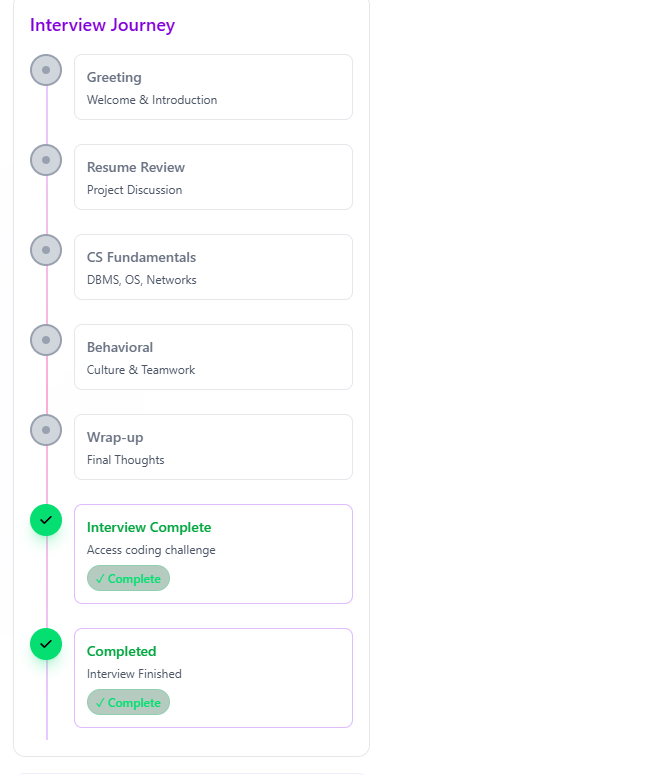
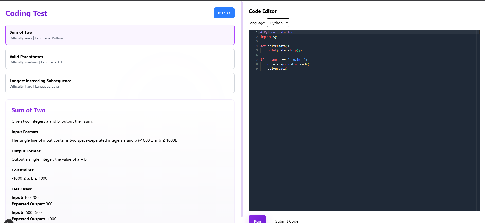
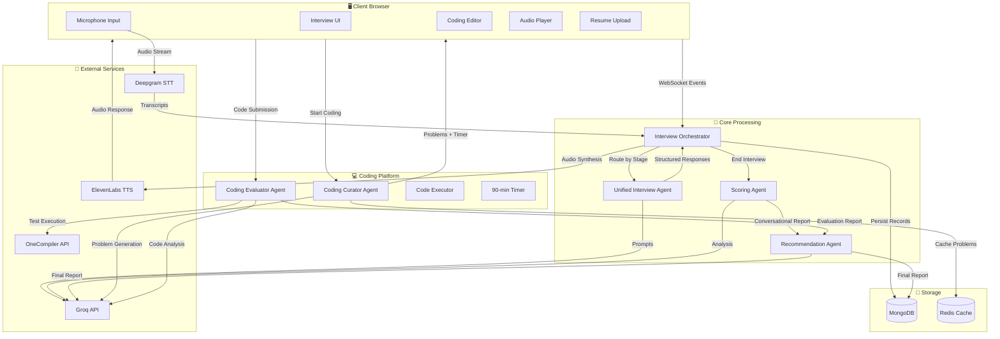

# Julius AI - Comprehensive Technical Interview Platform

Julius AI is an advanced AI-powered platform that conducts complete technical interviews through real-time voice interaction, structured conversational assessment, and separate coding evaluation. The system orchestrates a deterministic interview state machine with autonomous agents, culminating in detailed scoring and hiring recommendations that combine both conversational and coding performance metrics.

## Demo Video

Experience Julius AI in action:
[](https://youtu.be/gQ2PJVzWenE?si=your-share-link)

## Application Screenshots

### Interview Interface


### Coding Test Platform


## 🚀 Core Features

### Interview Assessment Pipeline
- **6-Stage Conversational Interview**: Greeting → Resume Review → Computer Science → Behavioral Questions → Wrap-up → Completion
- **Real-time Voice Interaction**: Speech-to-text and text-to-speech powered by Deepgram and ElevenLabs
- **Intelligent Conversational Scoring**: Comprehensive evaluation of communication skills, technical knowledge, and behavioral competencies
- **Resume-Driven Questions**: AI analyzes uploaded resumes to generate targeted, experience-specific questions
- **Adaptive Questioning**: Difficulty and progression adjust based on candidate responses and knowledge demonstration

### Separate Coding Challenge Platform
- **AI-Generated Problem Sets**: Curator agent creates 3 unique problems (easy/medium/hard) with starter templates
- **Multi-Language Support**: Java, Python, and C++ with syntax-highlighted code editors
- **90-Minute Timed Assessment**: Auto-submission with comprehensive evaluation
- **Automated Code Evaluation**: Test case execution, correctness validation, and AI-powered code analysis
- **Detailed Performance Metrics**: Scores across correctness, optimization, readability, and algorithmic efficiency

### End-to-End Evaluation System
- **Dual-Assessment Scoring**: Combines conversational interview performance with coding proficiency
- **Comprehensive Reports**: Strengths, weaknesses, improvement areas, and actionable recommendations
- **Hiring Recommendations**: Data-driven hire/no-hire decisions with detailed rationale
- **Performance Analytics**: Historical tracking and comparative analysis for recruiters

### Technical Architecture
- **Frontend**: Next.js 14 with TypeScript, Tailwind CSS, and real-time WebSocket integration
- **Backend**: Node.js with WebSocket server for low-latency audio processing
- **AI Integration**: Groq API for conversational agents, OpenAI for advanced evaluation
- **Voice Services**: Deepgram (STT) and ElevenLabs (TTS) with AWS fallbacks
- **Code Execution**: OneCompiler API for secure, sandboxed code testing
- **Data Persistence**: MongoDB for authoritative interview records, Redis for session caching and performance optimization

## Table of Contents

- Overview & Architecture
- Interview Flow (6 Stages)
- Coding Challenge Platform
- Real-time Voice Processing
- Evaluation & Scoring System
- Technical Implementation
- Directory Structure
- API Endpoints
- Deployment & Operations
- Security & Compliance

---

## Overview & Architecture

Julius AI revolutionizes technical interviewing by combining conversational AI assessment with practical coding evaluation. The platform maintains conversation history, adapts questions based on candidate responses, and provides comprehensive evaluation reports.

### System Architecture



---

## Interview Flow (6 Stages)

The interview follows a structured progression through conversational assessment stages, each driven by AI agents that adapt based on candidate responses.

### Stage 1: Greeting & Introduction
- **Agent**: Unified Interview Agent
- **Focus**: Rapport building, role expectations, technical background
- **Duration**: 3-4 targeted questions
- **Transition**: Advances to resume review after establishing context

### Stage 2: Resume Review & Experience
- **Agent**: Unified Interview Agent with resume analysis
- **Focus**: Experience validation, project deep-dives, technical achievements
- **Features**: AI extracts key artifacts from uploaded resume for specific questions
- **Transition**: Moves to technical assessment

### Stage 3: Computer Science Fundamentals
- **Agent**: Unified Interview Agent
- **Focus**: Algorithms, data structures, system design, problem-solving
- **Adaptation**: Difficulty scales based on demonstrated knowledge
- **Transition**: Advances to behavioral assessment or early wrap-up if knowledge gaps identified

### Stage 4: Behavioral & Soft Skills
- **Agent**: Unified Interview Agent
- **Focus**: Teamwork, leadership, conflict resolution, communication
- **Methodology**: STAR method for structured responses
- **Transition**: Proceeds to interview conclusion

### Stage 5: Wrap-up & Feedback
- **Agent**: Unified Interview Agent
- **Focus**: Overall experience, key takeaways, final questions
- **Transition**: Completes conversational interview

### Stage 6: Interview Completion
- **Trigger**: Scoring and recommendation generation
- **Output**: Conversational performance report
- **Next Step**: Access to coding challenge platform

---

## Coding Challenge Platform

Following interview completion, candidates access a separate coding assessment with AI-generated challenges.

### Problem Generation
- **Curator Agent**: Generates 3 unique problems across difficulty levels
- **Languages**: Java, Python, C++ with appropriate starter templates
- **Test Cases**: Comprehensive input/output validation
- **Caching**: Redis-backed problem storage for consistent assessment

### Assessment Environment
- **Timer**: 90-minute completion window with auto-submission
- **Editor**: Syntax-highlighted code editor with language switching
- **Testing**: Real-time test case execution and result display
- **Submission**: Manual or automatic code evaluation

### Evaluation Metrics
- **Correctness**: Test case pass/fail analysis (1-10 scale)
- **Optimization**: Time/space complexity assessment (1-10 scale)
- **Readability**: Code quality and maintainability scoring (1-10 scale)
- **Feedback**: AI-generated analysis with specific improvement suggestions

---

## Real-time Voice Processing

### Speech-to-Text Pipeline
- **Service**: Deepgram WebSocket streaming
- **Features**: Real-time transcription with interim results
- **Integration**: Direct WebSocket connection per session
- **Fallback**: AWS Transcribe for reliability

### Text-to-Speech Synthesis
- **Service**: ElevenLabs neural voice synthesis
- **Trigger**: Agent response generation
- **Format**: Base64 audio buffer delivery
- **Control**: Playback synchronization with microphone management

### Dual-Stream Logic
- **Speech Tracking**: Active speech detection and silence timeouts
- **Code Tracking**: Keystroke debouncing and idle detection
- **Invocation Rules**: Intelligent LLM triggering based on content readiness
- **Audio Management**: TTS playback blocking to prevent feedback loops

---

## Evaluation & Scoring System

### Conversational Assessment
- **Scoring Agent**: Analyzes interview performance across dimensions
- **Metrics**: Communication clarity, technical knowledge, problem-solving approach
- **Output**: Stage-wise breakdowns and overall performance score (1-100)
- **Recommendation**: Hire/No-hire with detailed rationale

### Coding Evaluation
- **Evaluator Agent**: Comprehensive code analysis
- **Execution**: Test case validation via OneCompiler API
- **Analysis**: AI-powered assessment of algorithm efficiency and code quality
- **Reporting**: Detailed feedback with strengths, weaknesses, and suggestions

### Final Recommendation
- **Recommendation Agent**: Synthesizes all assessment data
- **Integration**: Combines conversational and coding performance
- **Output**: Comprehensive hiring recommendation with actionable insights
- **Persistence**: MongoDB storage for audit and analytics

---

## Technical Implementation

### Core Components

#### Interview Orchestrator (`lib/services/orchestrator.ts`)
- Manages interview state machine
- Routes messages to appropriate agents
- Handles stage transitions and scoring triggers
- Persists interview records to MongoDB

#### Unified Interview Agent (`lib/services/unified_agent.ts`)
- Processes conversational stages
- Adapts questioning based on responses
- Integrates resume analysis for targeted questions
- Returns structured JSON responses

#### Coding Curator (`lib/services/coding_curator.ts`)
- Generates problem sets using Groq API
- Creates starter templates and test cases
- Caches problems in Redis for performance

#### Coding Evaluator (`lib/services/coding_evaluator.ts`)
- Executes code against test cases
- Performs AI analysis of solutions
- Generates detailed evaluation reports

### WebSocket Communication

#### Client → Server Events
- `start_transcription`: Initialize audio streaming
- `audio_chunk`: Base64 PCM audio data
- `text_input`: Fallback text messages
- `code_input`: Code submissions
- `set_resume_path`: Resume association

#### Server → Client Events
- `partial_transcript`: Real-time speech recognition
- `final_transcript`: Completed speech processing
- `agent_response`: AI agent replies
- `audio_response`: Synthesized speech audio
- `stage_changed`: Interview progression updates
- `scoring_result`: Performance evaluation
- `recommendation_result`: Final hiring recommendation

### Data Persistence Strategy

#### MongoDB (Authoritative)
- Interview step records
- Complete conversation history
- Scoring and recommendation reports
- User session data

#### Redis (Performance Cache)
- Session conversation context
- Curated problem sets
- Ephemeral session flags
- Rate limiting and counters

---

## Directory Structure

```
julius-ai/
├── app/                          # Next.js application
│   ├── api/                      # API route handlers
│   │   ├── curate-coding/        # Problem generation endpoints
│   │   ├── evaluate-coding/      # Code evaluation API
│   │   ├── interview-stage/      # Interview progression
│   │   ├── upload-resume/        # Resume processing
│   │   └── sessions/             # Session management
│   ├── coding-test/              # Coding assessment UI
│   ├── components/               # Reusable React components
│   ├── interview/                # Main interview interface
│   └── page.tsx                  # Landing page
├── core/                         # Runtime session management
│   ├── agent/                    # Agent orchestration
│   ├── audio/                    # Audio processing
│   ├── interview/                # Interview state models
│   ├── messaging/                # Message handling
│   └── server/                   # WebSocket server
├── lib/                          # Domain services & integrations
│   ├── models/                   # Data models & schemas
│   ├── prompts/                  # AI agent prompt templates
│   ├── services/                 # Business logic services
│   └── utils/                    # Helper utilities
├── ws-server/                    # WebSocket server for real-time audio
├── assests/                      # Static assets and images
├── tests/                        # Unit and integration tests
└── uploads/                      # User-uploaded files
```

---

## API Endpoints

### Interview Management
- `POST /api/sessions` - Create new interview session
- `GET /api/session-status` - Check session state
- `POST /api/interview-stage` - Advance interview stage

### Coding Assessment
- `GET /api/curate-coding` - Generate coding problems
- `POST /api/evaluate-coding` - Submit and evaluate code
- `GET /api/curate-coding/problem/[id]` - Retrieve cached problem

### File Management
- `POST /api/upload-resume` - Upload and process resume
- `GET /api/user/interviews` - Retrieve user interview history

### Administrative
- `GET /api/recruiter/sessions` - Access all sessions (recruiter view)

---

## Deployment & Operations

### Environment Setup
```bash
# Install dependencies
npm install

# Configure environment variables
cp .env.local.example .env.local
# Add API keys for Deepgram, ElevenLabs, Groq, etc.

# Start development servers
npm run ws-server    # WebSocket server on port 8080
npm run dev         # Next.js app on port 3000
```

### Production Deployment
- **WebSocket Server**: Dedicated service for audio processing
- **Next.js Application**: Standard deployment with API routes
- **Database**: MongoDB cluster with connection pooling
- **Cache**: Redis instance with persistence
- **Load Balancing**: Sticky sessions for WebSocket connections

### Monitoring & Scaling
- Horizontal scaling with session affinity
- Deepgram concurrency monitoring
- Redis-backed session state sharing
- Comprehensive error logging and alerting

---

## Security & Compliance

### Data Protection
- **Resume Handling**: Secure file storage with access controls
- **Session Data**: Encrypted conversation history
- **API Security**: Key rotation and access monitoring
- **PII Protection**: Minimal data retention policies

### Service Credentials
- Environment-based secret management
- No hardcoded API keys in repository
- Regular credential rotation
- Restricted access to production secrets

### Operational Security
- WebSocket connection validation
- Rate limiting on API endpoints
- Input sanitization and validation
- Secure code execution sandboxing

---

## Quick Start (Development)

1. **Clone and Install**
   ```bash
   git clone <repository-url>
   cd julius-ai
   npm install
   ```

2. **Environment Configuration**
   ```bash
   cp .env.local.example .env.local
   # Configure required API keys
   ```

3. **Database Setup**
   ```bash
   # Ensure MongoDB and Redis are running
   # Update connection strings in .env.local
   ```

4. **Start Services**
   ```bash
   npm run ws-server  # Terminal 1
   npm run dev       # Terminal 2
   ```

5. **Access Application**
   - Interview: http://localhost:3000/interview
   - Coding Test: http://localhost:3000/coding-test

---

## Contributing

### Development Guidelines
- Follow TypeScript strict mode
- Maintain comprehensive test coverage
- Use conventional commit messages
- Document API changes

### Code Quality
- ESLint configuration enforced
- Pre-commit hooks for validation
- Automated testing pipeline
- Performance monitoring

---

## License & Support

Julius AI is designed for comprehensive technical assessment, combining conversational intelligence with practical coding evaluation to provide recruiters with data-driven hiring insights.

For support or questions, please refer to the documentation or contact the development team.
