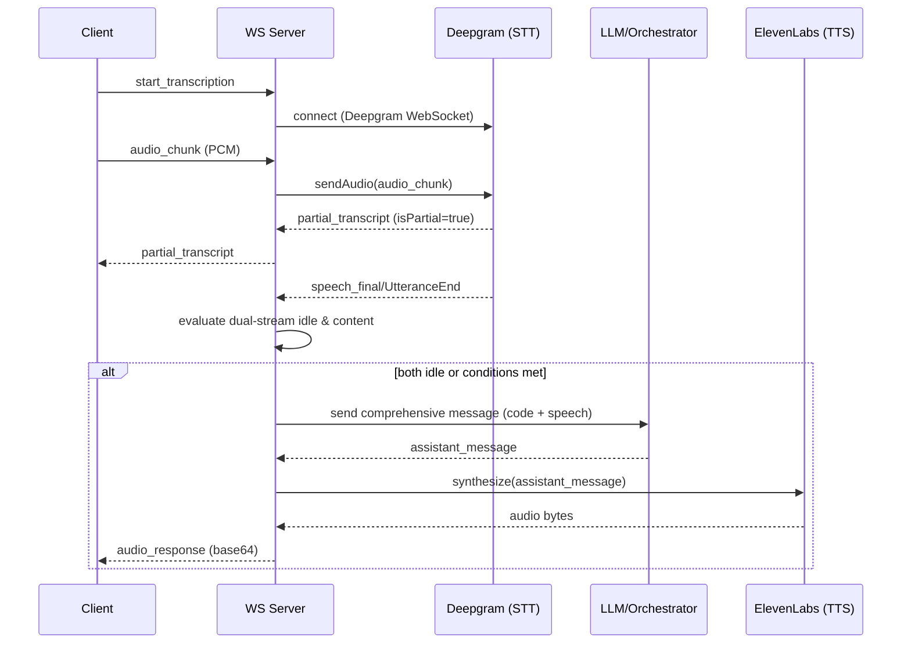
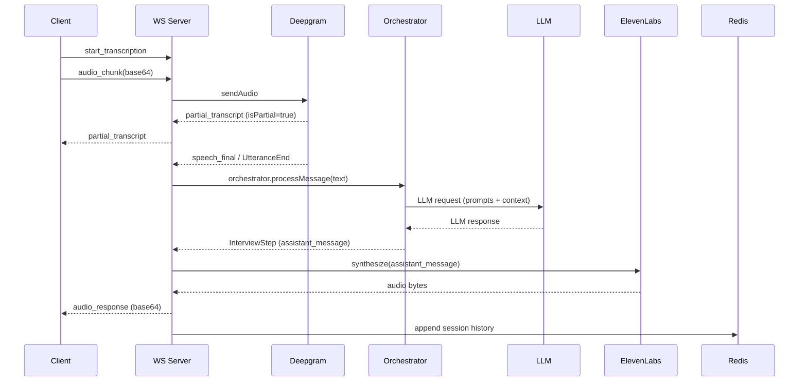
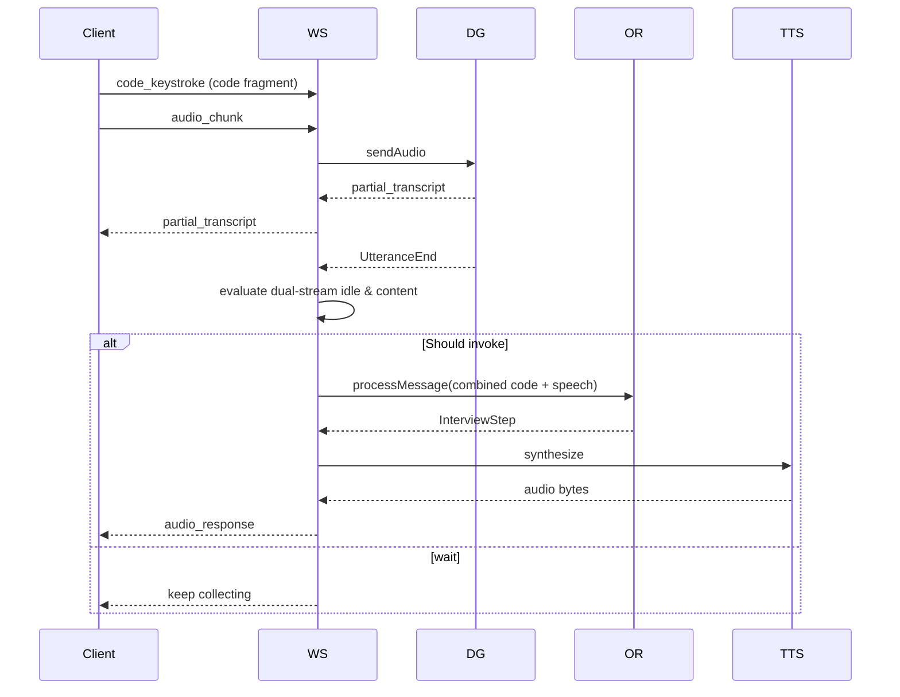

# Julius AI - Intelligent Interview Platform

Julius AI is a comprehensive, AI-powered technical interview platform that conducts full-stack interviews with real-time voice interaction, coding challenges, and detailed performance analytics. The system is driven by autonomous agents which return structured JSON `InterviewStep` objects; the orchestrator uses these objects to deterministically advance the interview state machine.

##  Demo Video
Check out the full walkthrough here:  
[](https://youtu.be/ef-nnittytc?si=pU6UyLKmKL69BBTw)

## 🚀 Features

### Core Capabilities
- **Multi-Stage Interview Flow**: Greeting → Resume Review → Coding Challenges → Computer Science → Behavioral Questions → Wrap-up
- **Real-time Voice Interaction**: Speech-to-text and text-to-speech powered by AWS Transcribe and Polly
- **Code Submission & Evaluation**: Live code editor with syntax highlighting and AI-powered code analysis
- **Intelligent Scoring**: Comprehensive evaluation across technical skills, communication, and behavioral aspects
- **Performance Analytics**: Detailed reports with strengths, improvement areas, and actionable recommendations

### Technical Architecture
- **Frontend**: Next.js 14 with TypeScript and Tailwind CSS
- **Backend**: Node.js with WebSocket real-time communication
- **AI Integration**: Groq API for natural language processing (agents return structured `InterviewStep` JSON)
- **Voice Services**: Deepgram (STT) and ElevenLabs (TTS)
- **Persistence & Storage**: MongoDB stores authoritative conversation history and InterviewStep records; Redis is used as a fast cache for curated problems, counters, and ephemeral session flags.
# Julius AI — Realtime Interview Platform (Comprehensive Architecture & Workflow)

This README documents the entire Julius AI system in exhaustive detail: design goals, every interview stage, realtime STT/TTS flow, event semantics, agent orchestration, coding-stage dual-stream logic, persistence, error-handling, security notes, and diagrams (Mermaid).

> NOTE: This repository evolved through multiple refactors. The live WebSocket server lives at `ws-server/server.ts`. STT is implemented via Deepgram (configurable), and TTS via ElevenLabs (configurable). The architecture uses MongoDB as the authoritative store for conversation history and persisted InterviewStep records, while Redis is used as a high-performance cache for curated problems, counters, and ephemeral session flags.

---

## Table of contents

- Overview & goals
- High-level architecture
- Events & WebSocket contract (client ↔ server)
- Interview stages (detailed)
  - Greeting
  - Resume Review
  - Coding
  - Computer Science (CS)
  - Behavioral
  - Wrap-up
-- Coding stage: dual-stream logic (very detailed)
-- Realtime STT/TTS flow (Deepgram -> LLM -> ElevenLabs) — sequence diagrams
-- Directory structure
-- Persistence & storage
  - End-of-interview evaluation
-- Agents & Orchestrator
- Error handling & retries
- Security & credentials
- Deployment & operational notes
- Appendix: mermaid diagrams and shorthand

---

## Overview & goals

Julius AI is a platform built to run realistic technical interviews with low-latency voice interactions and intelligent stage-driven logic. The system emphasizes:

 - Persistence in MongoDB for auditability and session resumption; Redis is used for ephemeral session context and caching.

This README explains the full data flow end-to-end and how the components coordinate.

---

## High-level architecture

- Frontend: Next.js + React (UI, microphone, code editor, controls)
- Realtime: WebSocket server (`ws-server/server.ts`) — receives audio chunks and other events
- STT: Deepgram (configurable) — web socket streaming connection per client session
- Orchestrator: `lib/services/orchestrator.ts` — stage machine that routes messages to agents
- Agents: Greeting/Project/Coding/CS/Behavioral/WrapUp/Scoring/Recommendation
- TTS: ElevenLabs (configurable) — synthesizes `assistant_message` into MP3/Buffer for client playback
- Storage: Redis for session conversation history and final transcripts
- Optional: AWS Transcribe/Polly fallback in earlier versions

## Directory structure (top-level)

The repository is organized into a few clear areas. Below is the high-level directory layout and the role of the most important folders/files (this is useful for contributors and operators):

```
app/                      # Next.js app (React pages, API routes in app/api/)
  api/                    # API route handlers (curator, judge0, sessions, upload-resume)
  coding/                 # UI pages for the coding flow
  coding-test/            # Landing + test runner pages for the coding test flow
  components/             # Reusable React components (CodeEditor, UI parts)

core/                     # Runtime interview session state and managers
  agent/                  # Agent handler glue code
  audio/                  # Audio manager
  coding/                 # Coding-specific runtime helpers
  interview/              # Interview session in-memory model
  messaging/              # Message processing helpers
  server/                 # WebSocket server adapters for the core server

lib/                      # Domain services & LLM integrations
  prompts/                # Prompt templates (curator, evaluator, unified_interview)
  services/               # Orchestrator, unified agent, scoring, curator services
  models/                 # Type definitions & domain models used by services
  utils/                  # Helpers: redis/mongo adapters, TTS/STT wrappers, groq client

ws-server/                # Lightweight WebSocket server used for low-latency audio flows
tests/                    # Unit tests (agent/service tests)
uploads/                  # Uploaded resumes and artifacts (S3 or local during dev)
README.md                 # This documentation
package.json, tsconfig*    # Build/config files
```

Notes:
- `lib/services` contains the orchestrator and agent adapters; prefer prompt edits in `lib/prompts` over heavy code changes.
- `core/interview/InterviewSession.ts` models the in-memory runtime state; persistent copies of `InterviewStep` objects are stored in MongoDB for audit & analytics.
- `ws-server/` is an alternative lightweight server optimized for audio; the Next.js API routes live under `app/api/`.

### Important files to inspect when changing behavior
- `ws-server/server.ts` — realtime audio + websocket handling
- `lib/services/orchestrator.ts` — maps `InterviewStep` outputs to stage transitions
- `lib/prompts/unified_interview.txt` — the main prompt used by unified agents
- `app/components/CodeEditor.tsx` — simplified black editor used by the coding-test runner

## High-level architecture

- Frontend: Next.js + React (UI, microphone, code editor, controls)
- Realtime: WebSocket server (`ws-server/server.ts`) — receives audio chunks and other events
- STT: Deepgram (configurable) — web socket streaming connection per client session
- Orchestrator: `lib/services/orchestrator.ts` — stage machine that routes messages to agents
- Agents: Greeting/Project/Coding/CS/Behavioral/WrapUp/Scoring/Recommendation
- TTS: ElevenLabs (configurable) — synthesizes `assistant_message` into MP3/Buffer for client playback
- Storage: MongoDB stores authoritative conversation history and InterviewStep records; Redis is used as a fast cache for curated problems, counters, and ephemeral session flags.
- Optional: AWS Transcribe/Polly fallback in earlier versions


Diagram: high-level component layout (mermaid)

```mermaid
flowchart TB
  %% Client Layer
  subgraph CLIENT["🖥️ Client Browser (Next.js + React)"]
    UI[User Interface]
    MIC[Microphone Input]
    EDITOR[Code Editor]
    PLAYER[Audio Player]
    UPLOADER[Resume Uploader]
  end

  %% WebSocket Server Layer
  subgraph WS_SERVER["🌐 WebSocket Server (julius-ws)"]
    WS[WebSocket Handler]
    SESSION[Session Cache (Redis)]
    AUDIO_PROC[Audio Processing]
    DUAL_STREAM[Dual-Stream Logic<br/>Speech + Code]
  end

  %% External Services Layer
  subgraph STT_SERVICE["🎤 Speech-to-Text"]
    DEEPGRAM[Deepgram STT<br/>WebSocket Streaming]
    AWS_STT[AWS Transcribe<br/>Fallback]
  end

  subgraph TTS_SERVICE["🔊 Text-to-Speech"]
    ELEVENLABS[ElevenLabs TTS<br/>Primary]
    AWS_TTS[AWS Polly<br/>Fallback]
  end

  %% Core Processing Layer
  subgraph CORE["🧠 Core Processing"]
    ORCHESTRATOR[Orchestrator<br/>Stage Machine<br/>(persists to MongoDB)]
        
    subgraph AGENTS["AI Agents"]
      GREETING[Greeting Agent]
      PROJECT[Project/Resume Agent]
      CODING[Coding Agent]
      CS[Computer Science Agent]
      BEHAVIORAL[Behavioral Agent]
      WRAPUP[Wrap-up Agent]
      SCORING[Scoring Agent]
      RECOMMEND[Recommendation Agent]
    end
        
    subgraph LLM_SERVICES["🤖 LLM Services"]
      GROQ[Groq API]
      OPENAI[OpenAI API]
    end
  end

  %% Storage Layer
  subgraph STORAGE["💾 Storage & Persistence"]
    MONGO[(MongoDB<br/>Authoritative Interview History)]
    REDIS[(Redis Cache<br/>Curated Problems & Counters)]
    FILES[File System / Object Storage<br/>Resume Storage]
  end

  %% API Layer
  subgraph API["📡 API Endpoints"]
    UPLOAD_API[Resume Upload API<br/>/api/upload-resume]
  end

  %% Data Flow Connections

  %% Client to WebSocket
  CLIENT -.->|"WebSocket Events:<br/>• start_transcription<br/>• audio_chunk<br/>• code_input<br/>• code_keystroke<br/>• text_input"| WS_SERVER
  WS_SERVER -.->|"WebSocket Events:<br/>• partial_transcript<br/>• final_transcript<br/>• audio_response<br/>• agent_response<br/>• stage_changed"| CLIENT

  %% Audio Processing Flow
  MIC -->|Base64 PCM Audio| AUDIO_PROC
  AUDIO_PROC -->|Stream Audio| DEEPGRAM
  DEEPGRAM -->|Partial Transcripts| WS
  DEEPGRAM -->|Final Transcripts| DUAL_STREAM

  %% Code Processing Flow
  EDITOR -->|Keystrokes & Code| DUAL_STREAM
  DUAL_STREAM -->|Combined Message<br/>Code + Speech| ORCHESTRATOR

  %% Stage Management & Agent Routing
  ORCHESTRATOR -->|Route by Stage| GREETING
  ORCHESTRATOR -->|Route by Stage| PROJECT
  ORCHESTRATOR -->|Route by Stage| CODING
  ORCHESTRATOR -->|Route by Stage| CS
  ORCHESTRATOR -->|Route by Stage| BEHAVIORAL
  ORCHESTRATOR -->|Route by Stage| WRAPUP

  %% LLM Integration
  AGENTS -->|Prompts & Context| GROQ
  AGENTS -->|Prompts & Context| OPENAI
  GROQ -->|Responses| AGENTS
  OPENAI -->|Responses| AGENTS

  %% TTS Flow
  AGENTS -->|assistant_message| ELEVENLABS
  ELEVENLABS -->|Audio Buffer| WS
  WS -->|Base64 Audio| PLAYER

  %% Session Persistence
  SESSION <-->|Cache Get/Set| REDIS
  ORCHESTRATOR <-->|Persist InterviewStep| MONGO
  ORCHESTRATOR <-->|Read Context (fast)| REDIS

  %% Resume Handling
  UPLOADER -->|Multipart Upload| UPLOAD_API
  UPLOAD_API -->|Store File| FILES
  FILES -->|Resume Path| PROJECT
  CLIENT -.->|set_resume_path| SESSION

  %% Scoring & Recommendations (End of Interview)
  WRAPUP -->|Trigger Scoring| SCORING
  WRAPUP -->|Trigger Recommendations| RECOMMEND
  SCORING -->|Persist Results| MONGO
  RECOMMEND -->|Persist Results| MONGO

  %% Fallback Services
  DEEPGRAM -.->|Fallback| AWS_STT
  ELEVENLABS -.->|Fallback| AWS_TTS
  AWS_STT -.->|Transcripts| DUAL_STREAM
  AWS_TTS -.->|Audio| WS

  %% Interview Stages Flow
  subgraph STAGES["📋 Interview Flow"]
    STAGE1[1. Greeting]
    STAGE2[2. Resume Review]
    STAGE3[3. Coding Challenges]
    STAGE4[4. Computer Science]
    STAGE5[5. Behavioral Questions]
    STAGE6[6. Wrap-up & Scoring]
        
    STAGE1 --> STAGE2
    STAGE2 --> STAGE3
    STAGE3 --> STAGE4
    STAGE4 --> STAGE5
    STAGE5 --> STAGE6
  end

  STAGES -.->|Stage Context| ORCHESTRATOR

  %% Styling - Black background with white text
  classDef clientClass fill:#000000,stroke:#ffffff,stroke-width:2px,color:#ffffff
  classDef serverClass fill:#333333,stroke:#ffffff,stroke-width:2px,color:#ffffff
  classDef serviceClass fill:#1a1a1a,stroke:#ffffff,stroke-width:2px,color:#ffffff
  classDef storageClass fill:#2a2a2a,stroke:#ffffff,stroke-width:2px,color:#ffffff
  classDef agentClass fill:#404040,stroke:#ffffff,stroke-width:2px,color:#ffffff

  class CLIENT,UI,MIC,EDITOR,PLAYER,UPLOADER clientClass
  class WS_SERVER,WS,SESSION,AUDIO_PROC,DUAL_STREAM serverClass
  class STT_SERVICE,TTS_SERVICE,DEEPGRAM,ELEVENLABS,AWS_STT,AWS_TTS serviceClass
  class STORAGE,MONGO,REDIS,FILES storageClass
  class AGENTS,GREETING,PROJECT,CODING,CS,BEHAVIORAL,WRAPUP,SCORING,RECOMMEND agentClass
```

---

## WebSocket events (contract)

These are the canonical events exchanged between client and server. Keeping these stable is important for the frontend UI.

Client → Server

- `start_transcription`: client is opening microphone stream; server should prepare streaming STT
- `audio_chunk`: base64 PCM audio chunk (linear16) — delivered rapidly to server
- `stop_transcription`: client has stopped sending audio (end stream)
- `text_input`: typed message from client (fallback to text path)
- `code_input`: final code submission or explicit code message (text + code + language + explanation)
- `code_keystroke`: user typed in code editor (used for idle heuristics)
- `audio_playback_finished`: playback finished event from client (used to re-enable mic)
- `stage_change`: notify orchestrator to change stage (admin/test)
- `set_resume_path`: client informs server of uploaded resume path

Server → Client

- `connected`: session id and confirmation
- `transcription_started` / `transcription_stopped` / `transcription_blocked` / `transcription_unblocked`
- `stop_recording`: server requests client to stop microphone recording (during TTS playback)
- `start_recording`: server requests client to restart microphone recording (after TTS playback)
- `partial_transcript`: interim transcripts (isPartial true)
- `final_transcript`: final assembled transcript (isPartial false)
- `processing` / `processing_finished`: LLM processing status
- `agent_response`: the orchestrator's response object
- `generating_audio` / `audio_response` / `audio_playback_started` / `microphone_enabled`
- `stage_info` / `stage_changed` / `scoring_result` / `recommendation_result`
- `server_error`: generic error notifications

Important: `audio_response` contains the base64 audio buffer for the assistant's `assistant_message`. The client should play this audio and then notify server with `audio_playback_finished` so mic can be re-enabled.

---

## Interview stages — full detail (structured agent outputs)

All stage logic lives in the orchestrator (`lib/services/orchestrator.ts`). Each stage is driven by an Agent that returns a structured `InterviewStep` JSON object. The orchestrator advances stages only when `InterviewStep.current_substate` matches an allowed token — this removes ambiguity and keeps UI, audio, and persistence deterministic.

Stages and agents (concise):

1. Greeting
  - Agent: `GreetingAgent` — rapport, readiness checks
  - Move: `InterviewStep.current_substate = 'greet'`

2. Resume Review
  - Agent: `ProjectAgent` — highlights from uploaded resume; asks clarifying questions
  - Move: `InterviewStep.current_substate = 'resume'`

3. Coding
  - Agent: `CodingAgent` — curated coding challenges and evaluation
  - Trigger: recruiter/candidate clicks `Start Coding Test` or the orchestrator returns `coding` substate
  - On trigger: the Coding Curator service generates exactly 3 problems (easy/medium/hard). The UI opens a simplified black code editor with three problem tabs and three language options (Java, Python, C++). Each problem includes starter templates for all three languages.
  - Move: `InterviewStep.current_substate = 'coding'`

4. Computer Science (CS)
  - Agent: `CSAgent` — conceptual and design questions
  - Move: `InterviewStep.current_substate = 'cs'`

5. Behavioral
  - Agent: `BehaviouralAgent` — STAR-style behavioral prompts
  - Move: `InterviewStep.current_substate = 'behave'`

6. Wrap-up / End
  - Agent: `WrapUpAgent` — final messages and triggers for scoring/recommendations
  - Move: `InterviewStep.current_substate = 'wrap_up'` or `end`

Minimal `InterviewStep` contract (all agents must follow):

- `assistant_message`: string — text to speak/display
- `current_substate`: string — state token for orchestrator transitions

Optional structured fields commonly used:

- `audio`: base64 or metadata for TTS
- `scoring`: scoring object (technical & conversational)
- `recommendation`: hire/no-hire string and rationale
- `coding_evaluation`: per-problem Judge0 results and code-quality notes


---

## Coding stage — dual-stream invocation (very detailed)

The coding stage is the most complex part of the system because it mixes typed code edits with voice commentary. The goal is to avoid prematurely invoking the LLM while the candidate is mid-typing or mid-sentence, but still be responsive once the candidate pauses.

Key concepts & states tracked per session:

- `codingState`:
  - `codeContent` — latest code buffer
  - `lastKeystroke` — timestamp of last keystroke
  - `hasNewCode` — whether there is unsent/changed code
  - `isTyping` — true while keystroke debounce active
- `speechState`:
  - `speechContent` — accumulated speech transcript
  - `lastSpeech` — timestamp of last speech event
  - `isSpeaking` — whether interim transcripts are coming (VAD)
  - `hasNewSpeech` — whether there's new speech not yet sent to LLM
- `invocationState`:
  - `lastInvocation` — timestamp of last LLM call
  - `pendingInvocation` — blocking flag while LLM call is in flight
  - `audioPlaybackActive` — true while synthesised audio is playing (blocks STT)

Thresholds (configurable in `ws-server/constants.ts`):
- `KEYSTROKE_DEBOUNCE` — short debounce after keystroke (typical 400ms)
- `CODE_IDLE_THRESHOLD` — time without keystrokes before code is considered idle (e.g., 30000 ms)
- `SPEECH_SILENCE_THRESHOLD` — speech silence timeout (e.g., 1500 ms)

Invocation rules (core):

1. If user submits explicit `code_input` with text + code, immediately invoke LLM with combined message.
2. Otherwise, if in coding stage, we consider the following conditions to decide LLM invocation:
   - The session must not be in `pendingInvocation`.
   - There must be new content (either `hasNewCode` or `hasNewSpeech`).
   - One of these should be true:
     - Both speech and code are idle: `speechIdle && codeIdle`
     - Speech idle and there's new speech and no code content
     - Code idle and there's new code and no speech content
   - Additionally, we enforce a minimum time since last invocation (debounce ~1s)

3. When invocation occurs the server:
   - Sets `pendingInvocation = true` and records `lastInvocation`.
   - Crafts a comprehensive message that includes recent speech + code blocks.
   - Sends `final_transcript` to client with the assembled message.
   - Calls the orchestrator (`sendToAgent`) with the message. The orchestrator returns an `InterviewStep`.
   - Synthesizes audio for `assistant_message` and emits `audio_response` back to the client.

4. After LLM response returns, clear `pendingInvocation`, send `llm_processing_finished`.

Corner cases covered:
- Continuous typing: `isTyping` prevents invocation until the user stops for `KEYSTROKE_DEBOUNCE`.
- Back-to-back keystrokes: keystrokeTimer refreshes.
- Audio playback: when assistant audio is playing, `audioPlaybackActive` blocks STT to avoid feedback loops.

Sequence diagram (coding stage invocation):



---

## Realtime STT → LLM → TTS flow (explicit)

The system uses Deepgram for realtime speech-to-text. The important states:

- `interim_results`: Deepgram will stream interim/partial transcripts with `is_final=false`.
- `speech_final` / `UtteranceEnd`: Deepgram indicates a VAD-based endpoint.

Workflow when speech arrives:
1. Frontend sends `audio_chunk` messages containing base64 PCM bytes to the WS server.
2. WS server sends these bytes to a Deepgram WebSocket session using `DeepgramSTTService.sendAudio`.
3. Deepgram sends incremental transcript events back to the WS server. For each partial transcript the server emits `partial_transcript` to the client.
4. When Deepgram signals `speech_final` / `UtteranceEnd` the server schedules/executes `processSilence` which:
   - Assembles `session.currentTranscript` and marks it final.
   - If in coding stage, update `speechState` and run dual-stream invocation logic.
   - If not in coding stage, immediately call the orchestrator with the transcript.
5. Orchestrator returns an `InterviewStep` with `assistant_message` and `current_substate`.
6. Server synthesizes `assistant_message` via ElevenLabs, emits `audio_response` (base64) and `audio_playback_started`. When client finishes playback it sends back `audio_playback_finished` and the server unblocks microphone input.

Key invariant: only `assistant_message` audio is synthesized and emitted. The system does not stream TTS in partial form.

---

## How stage transitions are decided

- Each Agent returns `InterviewStep.current_substate`.
- The orchestrator (`InterviewOrchestrator`) moves to next stage only when the agent returns one of the allowed substate tokens listed above. Do not use 'ready_to_move'.
- Stage transitions are broadcast by the server via `stage_changed` with previous and new stage info.

Example: After the agent returns `substate = 'resume'`, the orchestrator sets stage to `resume` and the server emits `stage_changed`.

---

## Resume upload & usage

1. Client uploads resume via `POST /api/upload-resume` (multipart/form-data). The API returns a path (e.g., `uploads/resumes/resume_...pdf`).
2. Client sends `set_resume_path` via WebSocket to associate the resume with the session.
3. The orchestrator's ProjectAgent will use the resume path to load/parse the resume (mammoth/pdf-parse/etc.) and include salient excerpts in prompts to the LLM.
4. The resume path is stored in Redis as part of the session context for audit and for scoring/recommendation agents when they run at the end.

Security note: Resume files may contain PII. Store them with restricted permissions and consider wiping after a configurable TTL.

---

## Agents & Orchestrator — internals

- The Orchestrator contains instances of each Agent and switches on the `InterviewStage` enum.
- Each Agent implements a `run(userMessage, extra?)` method that returns an `InterviewStep`.
- Agents are responsible for: constructing prompts, calling the LLM (Groq/OpenAI), post-processing responses, and returning structured `InterviewStep`s.
- The server treats the `InterviewStep` as authoritative for stage transitions and audio synthesis.

---

## Persistence & storage

The project uses a two-tier persistence model:

- MongoDB (authoritative): stores immutable InterviewStep records, final transcripts, scoring results, recommendations, and generated reports. All final, auditable data lives in MongoDB.
- Redis (ephemeral/high-performance cache): stores session-scoped ephemeral data such as curated problems cache, counters, short-lived session flags, and in-memory-like session context to speed orchestration. Redis keys use TTLs (default ~2 hours) and are not authoritative.

Key responsibilities:

- The orchestrator persists final `InterviewStep` objects and end-of-interview reports to MongoDB.
- Curator responses (the 3 curated problems) are cached in Redis using keys like `curator:${sessionId}:problems` to reduce LLM costs and improve UI responsiveness.
- Counters, rate-limits, and short-lived flags remain in Redis for low-latency operations.

### End-of-interview evaluation breakdown

At the end of an interview the system composes and persists a three-part evaluation document in MongoDB:

1. Technical scoring
  - Source: Judge0 execution results (per-problem), automated unit-test outcomes, and Coding Agent code-quality notes.
  - Persisted: per-problem numeric scores and an aggregated technical score.

2. Conversational & behavioral scoring
  - Source: Agent assessments of spoken and typed responses during CS and Behavioral stages.
  - Persisted: rubrics (numerical) and highlights (free-text) for communication, problem explanation, and behavioral indicators.

3. Recommendation & summary
  - Source: Recommendation Agent that combines scoring signals, agent rationales, and resume-derived context.
  - Persisted: `{ recommendation: 'hire'|'no-hire'|'maybe', rationale: string, strengths: string[], improvements: string[] }`.

All three parts are stored as nested objects on the Interview document in MongoDB and are accessible via API endpoints for report generation and recruiter dashboards.

---

## Error handling & retries

- STT: If Deepgram connection fails, the server emits `server_error` and may attempt reconnection on the next audio chunk. Consider exponential backoff.
- TTS: ElevenLabs errors are logged and do not block the agent response; clients still get the `agent_response` text even if audio fails.
- LLM: Orchestrator calls to LLM are wrapped in try/catch; failures produce `server_error` and `processing_finished` notifications.
- Session cleanup: On WebSocket `close`, the server will stop any streaming connections and clear timers. Ensure `audioPlaybackActive` is cleared when playback finishes.

---

## Security & credentials

- Do NOT commit service account JSON, API keys, or other secrets. The repo currently contains a credential file — remove it and rotate the key.
- Use environment variables and secret managers in production. Example envs in `.env.local`:
  - `DEEPGRAM_API_KEY`, `ELEVENLABS_API_KEY`, `AWS_ACCESS_KEY_ID`, `AWS_SECRET_ACCESS_KEY`, `REDIS_URL`.
- Restrict access to uploaded resumes and logs.

---

## Deployment & scaling considerations

- Each WebSocket session currently uses a Deepgram WebSocket; large concurrent user loads require verifying Deepgram concurrency limits.
- Use horizontal scaling with a sticky session load balancer or a centralized STT gateway to reduce per-node connection count.
- Use Redis for shared session state across nodes.

---

## Mermaid diagrams — sequence & workflow

### Overall realtime flow



### Forked flow: coding stage dual-stream



---

## Appendix — Technical concepts explained

- VAD / Endpointing: voice activity detection; Deepgram emits `speech_final` or `UtteranceEnd` when it detects a pause or end of a spoken phrase. We use these signals to decide whether to call the LLM.
- Interim transcripts: partial updates while the user is speaking. These are useful for showing live text to the candidate but not calling the LLM.
 - Dual-stream: mixing typed code edits and spoken commentary. We track both streams independently and invoke the LLM only when both streams are idle or a final submission arrives.
 - single-source-of-truth: MongoDB stores the authoritative interview records for replay, audits, and scoring; Redis is used as a cache for ephemeral session state.

---

## Quick start (developer)

1. Install dependencies
```powershell
npm install
```

2. Create `.env.local` with required keys

3. Start servers
```powershell
npm run ws-server
npm run dev
```

---

## Closing notes

This README aims to be the single authoritative source for how Julius AI works. If anything is unclear or if you want diagrams exported to the repo as SVGs or PNGs, tell me which diagram and I'll generate it.

Julius AI — built for realistic, low-latency interviews.
