# Julius AI - Intelligent Interview Platform

Julius AI is a comprehensive, AI-powered technical interview platform that conducts full-stack interviews with real-time voice interaction, coding challenges, and detailed performance analytics.

##  Demo Video
Check out the full walkthrough here:  
[](https://youtu.be/ef-nnittytc?si=pU6UyLKmKL69BBTw)

## 🚀 Features

### Core Capabilities
- **Multi-Stage Interview Flow**: Greeting → Resume Review → Coding Challenges → Computer Science → Behavioral Questions → Wrap-up
- **Real-time Voice Interaction**: Speech-to-text and text-to-speech powered by AWS Transcribe and Polly
- **Code Submission & Evaluation**: Live code editor with syntax highlighting and AI-powered code analysis
- **Intelligent Scoring**: Comprehensive evaluation across technical skills, communication, and behavioral aspects
- **Performance Analytics**: Detailed reports with strengths, improvement areas, and actionable recommendations

### Technical Architecture
- **Frontend**: Next.js 14 with TypeScript and Tailwind CSS
- **Backend**: Node.js with WebSocket real-time communication
- **AI Integration**: Groq API for natural language processing
- **Voice Services**: AWS Transcribe (STT) and AWS Polly (TTS)
- **Session Management**: Redis for persistent conversation storage
# Julius AI — Realtime Interview Platform (Comprehensive Architecture & Workflow)

This README documents the entire Julius AI system in exhaustive detail: design goals, every interview stage, realtime STT/TTS flow, event semantics, agent orchestration, coding-stage dual-stream logic, persistence, error-handling, security notes, and diagrams (Mermaid).

> NOTE: This repository evolved through multiple refactors. The live WebSocket server lives at `ws-server/server.ts`. STT is implemented via Deepgram (configurable), and TTS via ElevenLabs (configurable). The architecture deliberately keeps Redis as the single source-of-truth for session history.

---

## Table of contents

- Overview & goals
- High-level architecture
- Events & WebSocket contract (client ↔ server)
- Interview stages (detailed)
  - Greeting
  - Resume Review
  - Coding
  - Computer Science (CS)
  - Behavioral
  - Wrap-up
- Coding stage: dual-stream logic (very detailed)
- Realtime STT/TTS flow (Deepgram -> LLM -> ElevenLabs) — sequence diagrams
- Persistence & Redis
- Agents & Orchestrator
- Error handling & retries
- Security & credentials
- Deployment & operational notes
- Appendix: mermaid diagrams and shorthand

---

## Overview & goals

Julius AI is a platform built to run realistic technical interviews with low-latency voice interactions and intelligent stage-driven logic. The system emphasizes:

- Realtime audio capture and transcription (STT) with partial/interim transcripts.
- Low-latency agent (LLM) invocation when user silence or coding idleness indicates intent.
- Natural TTS for assistant replies and audio playback orchestration.
- Per-stage specialized behavior (different heuristics for coding vs conversation).
- Persistance in Redis for auditability and session resumption.

This README explains the full data flow end-to-end and how the components coordinate.

---

## High-level architecture

- Frontend: Next.js + React (UI, microphone, code editor, controls)
- Realtime: WebSocket server (`ws-server/server.ts`) — receives audio chunks and other events
- STT: Deepgram (configurable) — web socket streaming connection per client session
- Orchestrator: `lib/services/orchestrator.ts` — stage machine that routes messages to agents
- Agents: Greeting/Project/Coding/CS/Behavioral/WrapUp/Scoring/Recommendation
- TTS: ElevenLabs (configurable) — synthesizes `assistant_message` into MP3/Buffer for client playback
- Storage: Redis for session conversation history and final transcripts
- Optional: AWS Transcribe/Polly fallback in earlier versions


Diagram: high-level component layout (mermaid)

```mermaid
flowchart TB
    %% Client Layer
    subgraph CLIENT["🖥️ Client Browser (Next.js + React)"]
        UI[User Interface]
        MIC[Microphone Input]
        EDITOR[Code Editor]
        PLAYER[Audio Player]
        UPLOADER[Resume Uploader]
    end

    %% WebSocket Server Layer
    subgraph WS_SERVER["🌐 WebSocket Server (julius-ws)"]
        WS[WebSocket Handler]
        SESSION[Session Manager]
        AUDIO_PROC[Audio Processing]
        DUAL_STREAM[Dual-Stream Logic<br/>Speech + Code]
    end

    %% External Services Layer
    subgraph STT_SERVICE["🎤 Speech-to-Text"]
        DEEPGRAM[Deepgram STT<br/>WebSocket Streaming]
        AWS_STT[AWS Transcribe<br/>Fallback]
    end

    subgraph TTS_SERVICE["🔊 Text-to-Speech"]
        ELEVENLABS[ElevenLabs TTS<br/>Primary]
        AWS_TTS[AWS Polly<br/>Fallback]
    end

    %% Core Processing Layer
    subgraph CORE["🧠 Core Processing"]
        ORCHESTRATOR[Orchestrator<br/>Stage Machine]
        
        subgraph AGENTS["AI Agents"]
            GREETING[Greeting Agent]
            PROJECT[Project/Resume Agent]
            CODING[Coding Agent]
            CS[Computer Science Agent]
            BEHAVIORAL[Behavioral Agent]
            WRAPUP[Wrap-up Agent]
            SCORING[Scoring Agent]
            RECOMMEND[Recommendation Agent]
        end
        
        subgraph LLM_SERVICES["🤖 LLM Services"]
            GROQ[Groq API]
            OPENAI[OpenAI API]
        end
    end

    %% Storage Layer
    subgraph STORAGE["💾 Storage & Persistence"]
        REDIS[(Redis<br/>Session Store<br/>Chat History)]
        FILES[File System<br/>Resume Storage]
    end

    %% API Layer
    subgraph API["📡 API Endpoints"]
        UPLOAD_API[Resume Upload API<br/>/api/upload-resume]
    end

    %% Data Flow Connections
    
    %% Client to WebSocket
    CLIENT -.->|"WebSocket Events:<br/>• start_transcription<br/>• audio_chunk<br/>• code_input<br/>• code_keystroke<br/>• text_input"| WS_SERVER
    WS_SERVER -.->|"WebSocket Events:<br/>• partial_transcript<br/>• final_transcript<br/>• audio_response<br/>• agent_response<br/>• stage_changed"| CLIENT

    %% Audio Processing Flow
    MIC -->|Base64 PCM Audio| AUDIO_PROC
    AUDIO_PROC -->|Stream Audio| DEEPGRAM
    DEEPGRAM -->|Partial Transcripts| WS
    DEEPGRAM -->|Final Transcripts| DUAL_STREAM

    %% Code Processing Flow
    EDITOR -->|Keystrokes & Code| DUAL_STREAM
    DUAL_STREAM -->|Combined Message<br/>Code + Speech| ORCHESTRATOR

    %% Stage Management & Agent Routing
    ORCHESTRATOR -->|Route by Stage| GREETING
    ORCHESTRATOR -->|Route by Stage| PROJECT
    ORCHESTRATOR -->|Route by Stage| CODING
    ORCHESTRATOR -->|Route by Stage| CS
    ORCHESTRATOR -->|Route by Stage| BEHAVIORAL
    ORCHESTRATOR -->|Route by Stage| WRAPUP

    %% LLM Integration
    AGENTS -->|Prompts & Context| GROQ
    AGENTS -->|Prompts & Context| OPENAI
    GROQ -->|Responses| AGENTS
    OPENAI -->|Responses| AGENTS

    %% TTS Flow
    AGENTS -->|assistant_message| ELEVENLABS
    ELEVENLABS -->|Audio Buffer| WS
    WS -->|Base64 Audio| PLAYER

    %% Session Persistence
    SESSION <-->|Store/Retrieve<br/>Chat History| REDIS
    ORCHESTRATOR <-->|Load Context<br/>Save Results| REDIS

    %% Resume Handling
    UPLOADER -->|Multipart Upload| UPLOAD_API
    UPLOAD_API -->|Store File| FILES
    FILES -->|Resume Path| PROJECT
    CLIENT -.->|set_resume_path| SESSION

    %% Scoring & Recommendations (End of Interview)
    WRAPUP -->|Trigger Scoring| SCORING
    WRAPUP -->|Trigger Recommendations| RECOMMEND
    SCORING -->|Results| REDIS
    RECOMMEND -->|Results| REDIS

    %% Fallback Services
    DEEPGRAM -.->|Fallback| AWS_STT
    ELEVENLABS -.->|Fallback| AWS_TTS
    AWS_STT -.->|Transcripts| DUAL_STREAM
    AWS_TTS -.->|Audio| WS

    %% Interview Stages Flow
    subgraph STAGES["📋 Interview Flow"]
        STAGE1[1. Greeting]
        STAGE2[2. Resume Review]
        STAGE3[3. Coding Challenges]
        STAGE4[4. Computer Science]
        STAGE5[5. Behavioral Questions]
        STAGE6[6. Wrap-up & Scoring]
        
        STAGE1 --> STAGE2
        STAGE2 --> STAGE3
        STAGE3 --> STAGE4
        STAGE4 --> STAGE5
        STAGE5 --> STAGE6
    end

    STAGES -.->|Stage Context| ORCHESTRATOR

    %% Styling - Black background with white text
    classDef clientClass fill:#000000,stroke:#ffffff,stroke-width:2px,color:#ffffff
    classDef serverClass fill:#333333,stroke:#ffffff,stroke-width:2px,color:#ffffff
    classDef serviceClass fill:#1a1a1a,stroke:#ffffff,stroke-width:2px,color:#ffffff
    classDef storageClass fill:#2a2a2a,stroke:#ffffff,stroke-width:2px,color:#ffffff
    classDef agentClass fill:#404040,stroke:#ffffff,stroke-width:2px,color:#ffffff

    class CLIENT,UI,MIC,EDITOR,PLAYER,UPLOADER clientClass
    class WS_SERVER,WS,SESSION,AUDIO_PROC,DUAL_STREAM serverClass
    class STT_SERVICE,TTS_SERVICE,DEEPGRAM,ELEVENLABS,AWS_STT,AWS_TTS serviceClass
    class STORAGE,REDIS,FILES storageClass
    class AGENTS,GREETING,PROJECT,CODING,CS,BEHAVIORAL,WRAPUP,SCORING,RECOMMEND agentClass
```



---

## WebSocket events (contract)

These are the canonical events exchanged between client and server. Keeping these stable is important for the frontend UI.

Client → Server

- `start_transcription`: client is opening microphone stream; server should prepare streaming STT
- `audio_chunk`: base64 PCM audio chunk (linear16) — delivered rapidly to server
- `stop_transcription`: client has stopped sending audio (end stream)
- `text_input`: typed message from client (fallback to text path)
- `code_input`: final code submission or explicit code message (text + code + language + explanation)
- `code_keystroke`: user typed in code editor (used for idle heuristics)
- `audio_playback_finished`: playback finished event from client (used to re-enable mic)
- `stage_change`: notify orchestrator to change stage (admin/test)
- `set_resume_path`: client informs server of uploaded resume path

Server → Client

- `connected`: session id and confirmation
- `transcription_started` / `transcription_stopped` / `transcription_blocked` / `transcription_unblocked`
- `stop_recording`: server requests client to stop microphone recording (during TTS playback)
- `start_recording`: server requests client to restart microphone recording (after TTS playback)
- `partial_transcript`: interim transcripts (isPartial true)
- `final_transcript`: final assembled transcript (isPartial false)
- `processing` / `processing_finished`: LLM processing status
- `agent_response`: the orchestrator's response object
- `generating_audio` / `audio_response` / `audio_playback_started` / `microphone_enabled`
- `stage_info` / `stage_changed` / `scoring_result` / `recommendation_result`
- `server_error`: generic error notifications

Important: `audio_response` contains the base64 audio buffer for the assistant's `assistant_message`. The client should play this audio and then notify server with `audio_playback_finished` so mic can be re-enabled.

---

## Interview stages — full detail

All stage logic lives in the orchestrator (`lib/services/orchestrator.ts`). Each stage maps to a specific Agent:

1. Greeting
   - Agent: `GreetingAgent`
   - Goal: Short rapport-building conversation and capture readiness
  - Signals to move on: `InterviewStep.substate` must be one of the allowed tokens (see below). The orchestrator advances stages based only on these returned tokens.
   - Typical latency: low — the agent responds rapidly to single-turn inputs

2. Resume Review
   - Agent: `ProjectAgent`
   - Goal: Use uploaded resume to surface talking points and ask clarifying questions
   - Input required: resume file (path configured via `set_resume_path`)
  - Move condition: agent returns one of the allowed substates (`greet`,`resume`,`coding`,`cs`,`behave`,`wrap_up`,`end`)

3. Coding
   - Agent: `CodingAgent`
   - Goal: Present live coding challenges and evaluate submitted code
   - Special: This stage uses the dual-stream (speech + code) invocation logic — see the separate section below
  - Move condition: `substate` one of the allowed tokens listed above.

4. Computer Science (CS)
  - Agent: `CSAgent`
  - Goal: Ask concept and system-design questions; capture responses via speech or text
  - Move: driven by returned `substate` token (allowed: `greet`,`resume`,`coding`,`cs`,`behave`,`wrap_up`,`end`)

5. Behavioral
   - Agent: `BehaviouralAgent`
   - Goal: STAR questions, situational behavior; evaluate for cultural fit
  - Move: driven by returned `substate` token (allowed: `greet`,`resume`,`coding`,`cs`,`behave`,`wrap_up`,`end`)

6. Wrap-up
   - Agent: `WrapUpAgent`
   - Goal: Close the interview; trigger scoring and recommendation agents in parallel
   - Move: finish (InterviewStage.COMPLETED)


Each agent returns an `InterviewStep` object containing (at minimum):
- `assistant_message` (string)
- `current_substate` (string) — used to determine transitions
- Optional structured payloads like audio, scoring results, or recommendations

---

## Coding stage — dual-stream invocation (very detailed)

The coding stage is the most complex part of the system because it mixes typed code edits with voice commentary. The goal is to avoid prematurely invoking the LLM while the candidate is mid-typing or mid-sentence, but still be responsive once the candidate pauses.

Key concepts & states tracked per session:

- `codingState`:
  - `codeContent` — latest code buffer
  - `lastKeystroke` — timestamp of last keystroke
  - `hasNewCode` — whether there is unsent/changed code
  - `isTyping` — true while keystroke debounce active
- `speechState`:
  - `speechContent` — accumulated speech transcript
  - `lastSpeech` — timestamp of last speech event
  - `isSpeaking` — whether interim transcripts are coming (VAD)
  - `hasNewSpeech` — whether there's new speech not yet sent to LLM
- `invocationState`:
  - `lastInvocation` — timestamp of last LLM call
  - `pendingInvocation` — blocking flag while LLM call is in flight
  - `audioPlaybackActive` — true while synthesised audio is playing (blocks STT)

Thresholds (configurable in `ws-server/constants.ts`):
- `KEYSTROKE_DEBOUNCE` — short debounce after keystroke (typical 400ms)
- `CODE_IDLE_THRESHOLD` — time without keystrokes before code is considered idle (e.g., 30000 ms)
- `SPEECH_SILENCE_THRESHOLD` — speech silence timeout (e.g., 1500 ms)

Invocation rules (core):

1. If user submits explicit `code_input` with text + code, immediately invoke LLM with combined message.
2. Otherwise, if in coding stage, we consider the following conditions to decide LLM invocation:
   - The session must not be in `pendingInvocation`.
   - There must be new content (either `hasNewCode` or `hasNewSpeech`).
   - One of these should be true:
     - Both speech and code are idle: `speechIdle && codeIdle`
     - Speech idle and there's new speech and no code content
     - Code idle and there's new code and no speech content
   - Additionally, we enforce a minimum time since last invocation (debounce ~1s)

3. When invocation occurs the server:
   - Sets `pendingInvocation = true` and records `lastInvocation`.
   - Crafts a comprehensive message that includes recent speech + code blocks.
   - Sends `final_transcript` to client with the assembled message.
   - Calls the orchestrator (`sendToAgent`) with the message. The orchestrator returns an `InterviewStep`.
   - Synthesizes audio for `assistant_message` and emits `audio_response` back to the client.

4. After LLM response returns, clear `pendingInvocation`, send `llm_processing_finished`.

Corner cases covered:
- Continuous typing: `isTyping` prevents invocation until the user stops for `KEYSTROKE_DEBOUNCE`.
- Back-to-back keystrokes: keystrokeTimer refreshes.
- Audio playback: when assistant audio is playing, `audioPlaybackActive` blocks STT to avoid feedback loops.

Sequence diagram (coding stage invocation):


---

## Realtime STT → LLM → TTS flow (explicit)

The system uses Deepgram for realtime speech-to-text. The important states:

- `interim_results`: Deepgram will stream interim/partial transcripts with `is_final=false`.
- `speech_final` / `UtteranceEnd`: Deepgram indicates a VAD-based endpoint.

Workflow when speech arrives:
1. Frontend sends `audio_chunk` messages containing base64 PCM bytes to the WS server.
2. WS server sends these bytes to a Deepgram WebSocket session using `DeepgramSTTService.sendAudio`.
3. Deepgram sends incremental transcript events back to the WS server. For each partial transcript the server emits `partial_transcript` to the client.
4. When Deepgram signals `speech_final` / `UtteranceEnd` the server schedules/executes `processSilence` which:
   - Assembles `session.currentTranscript` and marks it final.
   - If in coding stage, update `speechState` and run dual-stream invocation logic.
   - If not in coding stage, immediately call the orchestrator with the transcript.
5. Orchestrator returns an `InterviewStep` with `assistant_message` and `current_substate`.
6. Server synthesizes `assistant_message` via ElevenLabs, emits `audio_response` (base64) and `audio_playback_started`. When client finishes playback it sends back `audio_playback_finished` and the server unblocks microphone input.

Key invariant: only `assistant_message` audio is synthesized and emitted. The system does not stream TTS in partial form.

---

## How stage transitions are decided

- Each Agent returns `InterviewStep.current_substate`.
- The orchestrator (`InterviewOrchestrator`) moves to next stage only when the agent returns one of the allowed substate tokens listed above. Do not use 'ready_to_move'.
- Stage transitions are broadcast by the server via `stage_changed` with previous and new stage info.

Example: After the agent returns `substate = 'resume'`, the orchestrator sets stage to `resume` and the server emits `stage_changed`.

---

## Resume upload & usage

1. Client uploads resume via `POST /api/upload-resume` (multipart/form-data). The API returns a path (e.g., `uploads/resumes/resume_...pdf`).
2. Client sends `set_resume_path` via WebSocket to associate the resume with the session.
3. The orchestrator's ProjectAgent will use the resume path to load/parse the resume (mammoth/pdf-parse/etc.) and include salient excerpts in prompts to the LLM.
4. The resume path is stored in Redis as part of the session context for audit and for scoring/recommendation agents when they run at the end.

Security note: Resume files may contain PII. Store them with restricted permissions and consider wiping after a configurable TTL.

---

## Agents & Orchestrator — internals

- The Orchestrator contains instances of each Agent and switches on the `InterviewStage` enum.
- Each Agent implements a `run(userMessage, extra?)` method that returns an `InterviewStep`.
- Agents are responsible for: constructing prompts, calling the LLM (Groq/OpenAI), post-processing responses, and returning structured `InterviewStep`s.
- The server treats the `InterviewStep` as authoritative for stage transitions and audio synthesis.

---

## Persistence & Redis

- Redis stores the session transcript history and any intermediate InterviewStep results. Use `redisSession` utilities to append new messages and load historical context when the session restarts.
- Keep Redis as single source-of-truth for reconstructing sessions or running scoring/recommendation jobs after interview completion.

---

## Error handling & retries

- STT: If Deepgram connection fails, the server emits `server_error` and may attempt reconnection on the next audio chunk. Consider exponential backoff.
- TTS: ElevenLabs errors are logged and do not block the agent response; clients still get the `agent_response` text even if audio fails.
- LLM: Orchestrator calls to LLM are wrapped in try/catch; failures produce `server_error` and `processing_finished` notifications.
- Session cleanup: On WebSocket `close`, the server will stop any streaming connections and clear timers. Ensure `audioPlaybackActive` is cleared when playback finishes.

---

## Security & credentials

- Do NOT commit service account JSON, API keys, or other secrets. The repo currently contains a credential file — remove it and rotate the key.
- Use environment variables and secret managers in production. Example envs in `.env.local`:
  - `DEEPGRAM_API_KEY`, `ELEVENLABS_API_KEY`, `AWS_ACCESS_KEY_ID`, `AWS_SECRET_ACCESS_KEY`, `REDIS_URL`.
- Restrict access to uploaded resumes and logs.

---

## Deployment & scaling considerations

- Each WebSocket session currently uses a Deepgram WebSocket; large concurrent user loads require verifying Deepgram concurrency limits.
- Use horizontal scaling with a sticky session load balancer or a centralized STT gateway to reduce per-node connection count.
- Use Redis for shared session state across nodes.

---

## Mermaid diagrams — sequence & workflow

### Overall realtime flow


### Forked flow: coding stage dual-stream


---

## Appendix — Technical concepts explained

- VAD / Endpointing: voice activity detection; Deepgram emits `speech_final` or `UtteranceEnd` when it detects a pause or end of a spoken phrase. We use these signals to decide whether to call the LLM.
- Interim transcripts: partial updates while the user is speaking. These are useful for showing live text to the candidate but not calling the LLM.
- Dual-stream: mixing typed code edits and spoken commentary. We track both streams independently and invoke the LLM only when both streams are idle or a final submission arrives.
- single-source-of-truth: Redis keeps the session history for replay, audits, and scoring.

---

## Quick start (developer)

1. Install dependencies
```powershell
npm install
```

2. Create `.env.local` with required keys

3. Start servers
```powershell
npm run ws-server
npm run dev
```

---

## Closing notes

This README aims to be the single authoritative source for how Julius AI works. If anything is unclear or if you want diagrams exported to the repo as SVGs or PNGs, tell me which diagram and I'll generate it.

Julius AI — built for realistic, low-latency interviews.
